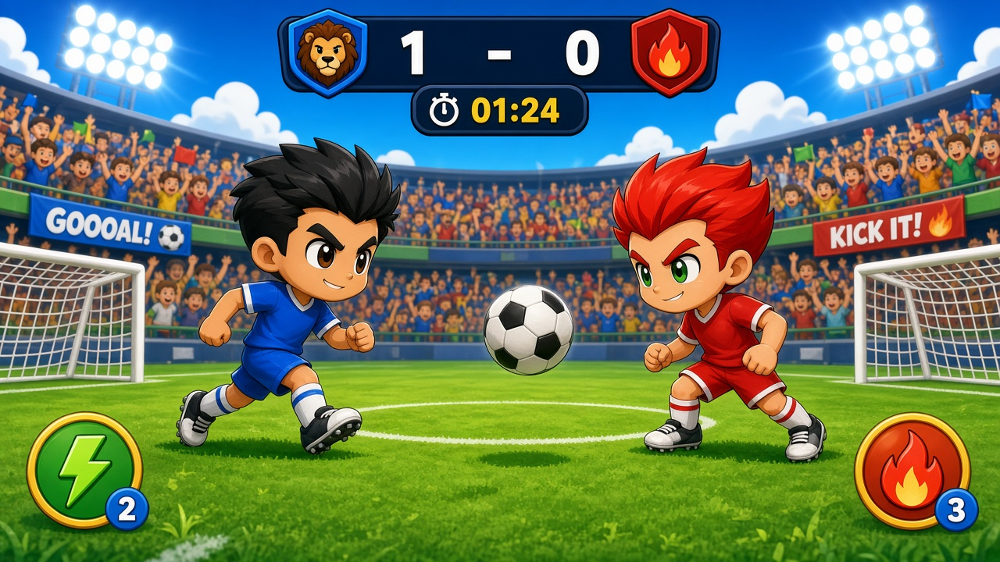
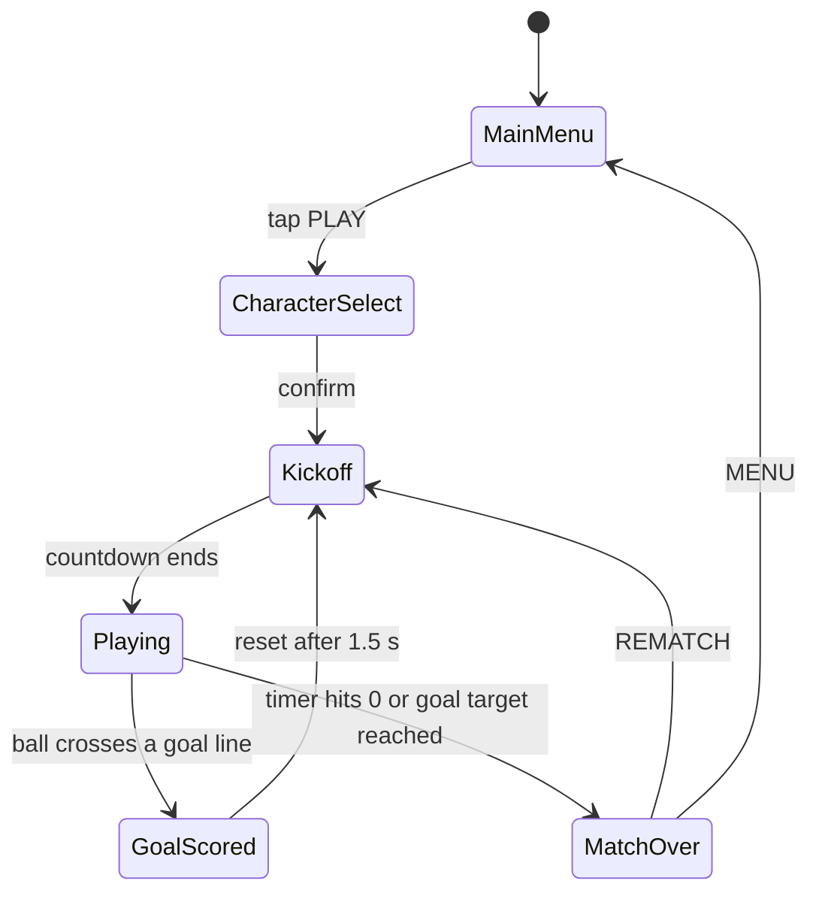
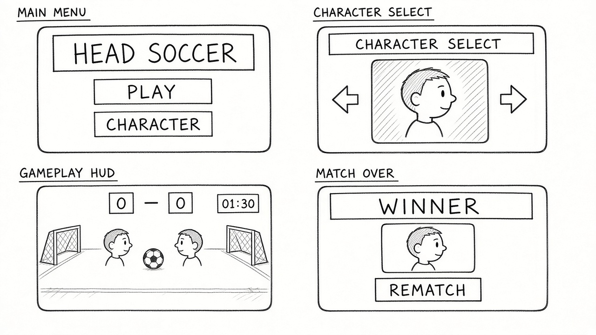
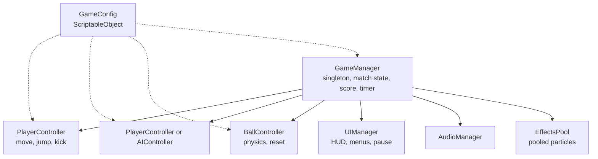

# Game Design Document, *Head Soccer*

| | |
|---|---|
| **Working title** | Head Soccer |
| **Team** | Guy Yad Shalom (design, programming, art integration, audio), Tomer Yad Shalom (design, programming, art integration, audio) |
| **Genre** | Arcade / 1v1 physics sports / local versus |
| **Target platform** | Android (mobile build), plus PC (Windows) standalone for development |
| **Engine / Unity version** | Unity 6 (6000.3.22f1), URP, 2D |
| **Orientation & reference resolution** | Landscape, 1280 x 720 reference |
| **Expected session length** | 30 seconds to 3 minutes per match |
| **Document version** | v1.0, 2026-09-10 |

---

## 1. High Concept

Two big headed characters face off on a single screen. Each player has one job: put the ball in the other goal. You run, jump, and kick, and the ball bounces off your head and body with arcade physics. First to the goal target, or the higher score when the clock hits zero, wins. A lost match restarts in one tap.

### Design pillars

1. **Readable at a glance** means one static screen, side view, no scrolling camera, so both players always see the whole pitch and the ball at once. This rules out large arenas, a second half of the field you cannot see, and any camera that follows the ball.
2. **Every goal is earned by physics** means power comes from timing your jump and kick against the ball, not from stats bought between matches. This rules out RPG progression, purchasable power, and pay to win characters.
3. **Ten second on-ramp** means a new player understands the entire game inside one match, and a loss costs seconds to retry. This rules out tutorials longer than one screen and any long unskippable intro.

---

## 2. Reference & Inspiration

- **Primary reference:** Head Soccer (D&D Dream, mobile). Taking: single screen 1v1, big head characters, lively arcade ball physics, matches under two minutes, one chargeable special shot. Not taking: the dozens of unlockable characters, the in app purchases, the online play, and the celebrity roster.
- **Video:** roughly 30 seconds of Head Soccer mobile gameplay, https://www.youtube.com/results?search_query=head+soccer+gameplay

The look I am after is the concept mockup above: two characters, two goals, one ball, and a scoreboard, all on one screen.

---

## 3. Core Game Loop

**Moment-to-moment rules** (things that are true every frame):

- Gravity pulls both characters and the ball down every frame. A character leaves the ground only by jumping, and cannot double jump.
- A kick applies a fixed impulse to the ball only when the ball is inside the character's kick range at the moment the kick is pressed. It never teleports the ball and never fires if the ball is out of range.
- The ball bounces off heads, bodies, walls, and the ceiling with a fixed bounciness, so rallies happen naturally, and the ball speed is capped so it always stays trackable.
- **Scoring:** a point is awarded the instant the ball fully crosses a goal line. The ball then resets to the center and a 3, 2, 1 kickoff starts.
- **Failure:** there is no player death. The failure state is losing the match, which ends when the timer reaches 0 or a player reaches the goal target, whichever comes first. In the 1.5 seconds after a goal, control is frozen for a short celebration, then kickoff resumes.

### Parameters you will need to tune

| Parameter | What it controls | First guess |
|---|---|---|
| `moveSpeed` | Horizontal run speed of a character | 6 u/s |
| `jumpVelocity` | Upward velocity of a single jump | 12 u/s |
| `gravityScale` | How fast characters and ball fall | 3 |
| `kickImpulse` | Force added to the ball on a connecting kick | 14 |
| `kickRange` | Radius around the character where a kick connects | 1.2 u |
| `ballBounciness` | How lively the ball is off surfaces | 0.7 |
| `ballMaxSpeed` | Speed cap so the ball stays trackable | 22 u/s |
| `matchLength` | Seconds on the match clock | 90 |
| `goalTarget` | Goals that end the match early | 5 |
| `superChargeTime` | Seconds of ball contact needed to fill the special shot | 6 |

**Where these live:** a `GameConfig` ScriptableObject at `Assets/Data/GameConfig.asset`, editable from the Inspector with no recompile.

**Feel target:** a first time player scores at least one goal in their first match, and a player who has grasped the kick timing can win a five goal match against the medium CPU within three attempts.

---

## 4. Controls & Input

| Action | Keyboard P1 | Keyboard P2 | Gamepad | Touch |
|---|---|---|---|---|
| Move left / right | A / D | Left / Right arrow | Left stick or D-pad | Left / right buttons on the left thumb side |
| Jump | W | Up arrow | South button | Jump button on the right thumb side |
| Kick / Special | Space | Right Ctrl | West button | Kick button on the right thumb side |
| Pause | Esc | Esc | Start button | Pause icon, top corner |

- Input is read on **press** in `Update`, buffered, and applied in `FixedUpdate`, so a jump or a kick is never dropped between physics steps and always lines up with the ball simulation.
- A press on a UI button (menu, pause, rematch) never triggers a kick or a jump in the match underneath it.
- On the match over screen there is a 0.5 second input lockout before REMATCH accepts input, so the final kick of a match does not skip straight past the result.
- On application focus loss the match pauses automatically.

---

## 5. Screens & UI

1. **Main Menu** with the title HEAD SOCCER, a PLAY button that opens Character Select, a CHARACTER button that opens the same screen directly, and a small settings icon for audio on and off.
2. **Character Select** with a character portrait in the center, left and right arrows to change character, the character name, a short stat hint (speed, jump, power), and a CONFIRM button that starts the match.
3. **Gameplay HUD** with a scoreboard P1 and P2 at the top center, a countdown timer beside it, and a special charge meter for each player. Deliberately absent: no minimap, no ads, no on-screen currency.
4. **Match Over** with a WINNER banner, the final score, a REMATCH button, and a MENU button.
5. **Pause overlay** with RESUME, RESTART, and QUIT to menu.

- **HUD during play:** score, timer, and the two special meters, and nothing else. Health bars, ads, and desktop control labels are deliberately absent so the pitch stays clear.
- **Canvas setup:** Screen Space, Camera, with CanvasScaler set to Scale With Screen Size, reference 1280 x 720, match = 0.5 so the layout adapts across phone aspect ratios.

---

## 6. Art & Audio

| Asset | Variants / frames | Source & licence | Use |
|---|---|---|---|
| Character (head plus body) | 2 characters, idle / run / jump / kick | Kenney or itch.io free 2D pack, CC0, or custom | The two players |
| Ball | 1 sprite | Kenney sports assets, CC0 | The ball |
| Pitch and stadium background | 1 | Kenney or OpenGameArt, CC0 | Static background |
| Goal net | 1 | CC0 pack | The two goals |
| SFX (kick, bounce, whistle, goal, crowd cheer) | 5 | Kenney audio or freesound CC0 | Feedback |
| Music (menu loop, match loop) | 2 | OpenGameArt or incompetech, CC0 or CC-BY | Ambience |

**Licence note:** every asset used is a free-to-use CC0 or CC-BY pack. For a public build, any CC-BY asset keeps its attribution in a credits screen and in the repository README, and any placeholder sprite is swapped for an original or commissioned one. Nothing here is taken from a source that forbids reuse.

**Technical art rules:** vector cartoon sprites import with Bilinear filtering, pixel art with Point (no filter), PPU 100, a single SpriteAtlas per scene to keep draw calls low, and sorting layers back to front: background, pitch, goals, ball, players, fx, UI.

---

## 7. Technical Design

**Scenes:** two scenes. `Menu.unity` holds the main menu and character select. `Match.unity` holds a single match. REMATCH reloads `Match.unity`, and QUIT loads `Menu.unity`.

**Packages / systems used:** Input System, Physics2D, URP 2D renderer, TextMeshPro, and Unity Android Build Support.

**Target device:** an Android phone as the demo device, with Windows standalone used during development.

**Architecture:**

| Script | Responsibility |
|---|---|
| `GameManager` | Singleton, match state machine, score, timer, kickoff, restart |
| `MatchState` | State enum (Menu, CharacterSelect, Kickoff, Playing, GoalScored, Paused, MatchOver) |
| `GameConfig` | ScriptableObject holding every tuning number |
| `PlayerController` | Reads input and drives move, jump, and kick for one character |
| `AIController` | Moves a character toward the ball and decides when to jump and kick |
| `BallController` | Ball physics, speed cap, and reset to center |
| `GoalTrigger` | Detects a scored goal once per ball entry |
| `KickHitbox` | Applies the kick impulse when the ball is in range |
| `UIManager` | HUD, menus, pause, and match over |
| `CharacterSelect` | Choosing a character and saving the choice |
| `AudioManager` | One-shot SFX and looping music |
| `EffectsPool` | Object pool for goal confetti, kick sparks, and dust |
| `SpecialShot` | Charges from ball contact time and fires a boosted shot |

### The course features you are implementing

1. **Singleton** appears as `GameManager`, the single source of truth for match state, score, and timer. Every system reads state from it, so there is never an ambiguous owner of the score or the clock.
2. **Object pooling** appears in goal confetti, kick sparks, and the ball trail, with a fixed set of recycled instances (for example 20). A goal spawns a burst of dozens of particles, and Instantiate and Destroy during a fast match cause GC spikes that drop frames, and a dropped frame during a kick is an unfair miss.
3. **Coroutines** appear in the 3, 2, 1 kickoff, the goal celebration freeze, and the special shot slow motion window. These are time sequenced one-shot flows, and they are far clearer as a coroutine than as timers scattered across `Update`.
4. **Compile to mobile** appears as an Android APK with on-screen touch controls. The reference is a phone game, so the touch build is the proof that this is a real product rather than an editor only toy.

---

## 8. Scope

### 8.1 MVP, the game is not a game without these

- [ ] One pitch and two characters on a single, non-scrolling screen
- [ ] Move, jump, and kick with arcade ball physics and a ball speed cap
- [ ] 1P versus CPU, and 2P versus 2P on one keyboard
- [ ] Scoreboard, match timer, kickoff, goal detection, and a match over screen with REMATCH
- [ ] `GameManager` singleton, pooled goal and kick effects, coroutine kickoff
- [ ] An Android APK that runs with touch controls

### 8.2 Polish, if the MVP is done and playable

- [ ] Character select with two or three characters that differ slightly in speed, jump, and power
- [ ] One special shot per character with slow motion and screen shake
- [ ] Crowd, confetti, dust, SFX, music, and a whistle
- [ ] Short intro before kickoff, a goal flash, and a best result kept in `PlayerPrefs`

### 8.3 Explicitly out of scope, we are **not** building these

- Online or networked multiplayer and any online leaderboard
- A large roster of 8 or more characters, an unlock economy, or in app purchases
- A world cup, tournament, or story mode with multiple stages
- 3D graphics or any scrolling or ball following camera
- A save system beyond `PlayerPrefs` for settings and best result
