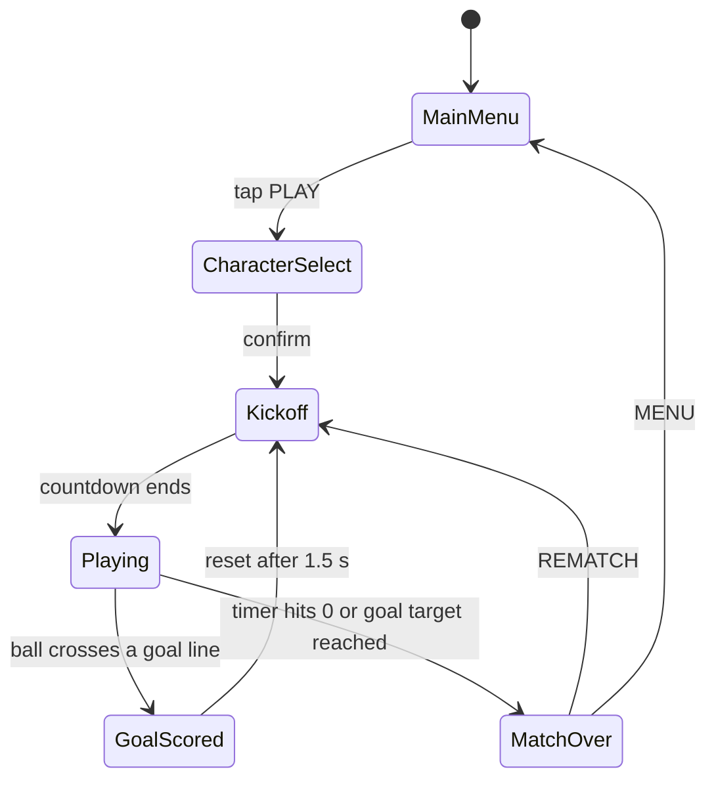
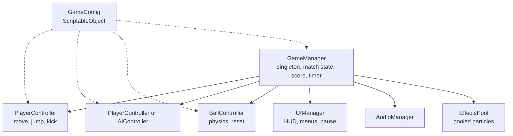

# Game Design Document, *Head Soccer*

| | |
|---|---|
| **Working title** | Head Soccer |
| **Team** | Guy Yad Shalom (design, programming, art integration, audio), Tomer Yad Shalom (design, programming, art integration, audio) |
| **Genre** | Arcade / 1v1 physics sports / local versus |
| **Target platform** | Android (mobile build), plus PC (Windows) standalone for development |
| **Engine / Unity version** | Unity 6 (6000.3.20f1), URP, 2D |
| **Orientation & reference resolution** | Landscape, 1280 x 720 reference |
| **Expected session length** | 30 seconds to 3 minutes per match |
| **Document version** | v1.14, 2026-10-03 |

---

## 1. High Concept

Two big headed characters face off on a single screen. Each player has one job: put the ball in the other goal. You run, jump, and kick, and the ball bounces off your head and body with arcade physics. First to the goal target, or the higher score when the clock hits zero, wins. A lost match restarts in one tap.

### Design pillars

1. **Readable at a glance** means one static screen, side view, no scrolling camera, so both players always see the whole pitch and the ball at once. This rules out large arenas, a second half of the field you cannot see, and any camera that follows the ball.
2. **Every goal is earned by physics** means power comes from timing your jump and kick against the ball, not from stats bought between matches. This rules out RPG progression, purchasable power, and pay to win characters.
3. **Ten second on-ramp** means a new player understands the entire game inside one match, and a loss costs seconds to retry. This rules out tutorials longer than one screen and any long unskippable intro.

---

## 2. Reference & Inspiration

- **Primary reference:** Head Soccer (D&D Dream, mobile). Taking: single screen 1v1, big head characters, lively arcade ball physics, matches under two minutes, one chargeable special shot. Not taking: the dozens of unlockable characters, the in app purchases, the online play, and the celebrity roster.
- **Video:** gameplay, https://www.youtube.com/watch?v=-y9mt8FlIkM

The look I am after is the concept mockup above: two characters, two goals, one ball, and a scoreboard, all on one screen.

---

## 3. Core Game Loop

```mermaid
stateDiagram-v2
    [*] --> MainMenu
    MainMenu --> CharacterSelect: tap PLAY
    CharacterSelect --> Kickoff: confirm
    Kickoff --> Playing: countdown ends
    Playing --> GoalScored: ball crosses a goal line
    GoalScored --> Kickoff: reset after 1.5 s
    Playing --> MatchOver: timer hits 0 or goal target reached
    MatchOver --> Kickoff: REMATCH
    MatchOver --> MainMenu: MENU
```

**Moment-to-moment rules** (things that are true every frame):

- Gravity pulls both characters and the ball down every frame. A character leaves the ground only by jumping, and cannot double jump.
- A kick applies a fixed impulse to the ball only when the ball is inside the character's kick range at the moment the kick is pressed. It never teleports the ball and never fires if the ball is out of range.
- A kick that lands on the rival shoves him a step back. The shove is small and follows the kicker's run, not a dice roll: a standing kick nudges, a kick on the run pushes a little further. Two players kicking at each other with the ball wedged between them used to lock the match in place with both kick animations stuck; the shove opens a gap and the ball moves again.
- The ball bounces off heads, bodies, walls, and the ceiling with a fixed bounciness, so rallies happen naturally, and the ball speed is capped so it always stays trackable.
- **Scoring:** a point is awarded the instant the ball fully crosses a goal line. The ball then resets to the center and a 3, 2, 1 kickoff starts.
- **Failure:** there is no player death. The failure state is losing the match, which ends when the timer reaches 0 or a player reaches the goal target, whichever comes first. In the 1.5 seconds after a goal, control is frozen for a short celebration, then kickoff resumes.

### Parameters you will need to tune

| Parameter | What it controls | First guess |
|---|---|---|
| `moveSpeed` | Horizontal run speed of a character | 6 u/s |
| `jumpVelocity` | Upward velocity of a single jump | 12 u/s |
| `gravityScale` | How fast characters and ball fall | 3 |
| `kickImpulse` | Force added to the ball on a connecting kick | 14 |
| `kickRange` | Radius around the character where a kick connects | 1.2 u |
| `kickMinAngle`, `kickMaxAngle` | Each kick leaves the foot at a fresh random angle in this range, from a flat drive to a lob | 0 to 45 degrees |
| `kickMomentumBonus` | How much harder a running kick hits than a standing one | +50% at full speed |
| `kickPushback`, `kickPushbackLift`, `kickPushbackDecay` | How far a kick that lands on the rival shoves him back, scaled by the same momentum bonus, and how fast the shove fades | 4 u/s, 2 u/s lift, fades at 14 u/s per second |
| `ballBounciness` | How lively the ball is off surfaces | 0.7 |
| `ballMaxSpeed` | Speed cap so the ball stays trackable | 22 u/s |
| `matchLength` | Seconds on the match clock | 90 |
| `goalTarget` | Goals that end the match early | 5 |
| `superChargeTime` | Seconds of ball contact needed to fill the special shot | 6 |

**Where these live:** a `GameConfig` ScriptableObject at `Assets/Data/GameConfig.asset`, editable from the Inspector with no recompile.

**Feel target:** a first time player scores at least one goal in their first match, and a player who has grasped the kick timing can win a five goal match against the medium CPU within three attempts.

---

## 4. Controls & Input

| Action | Keyboard layout WASD (P1 default) | Keyboard layout ARROWS (P2 default) | Gamepad | Touch |
|---|---|---|---|---|
| Move left / right | A / D | Left / Right arrow | Left stick or D-pad | Left / right buttons on the left thumb side |
| Jump | W | Up arrow | South button | Jump button on the right thumb side |
| Kick / Special | Space | Right Ctrl | West or East button | Kick button on the right thumb side |
| Special only (optional chord) | Tab + Shift | Up + Down | North button or a shoulder button | not needed, Kick fires it when the meter is full |
| Pause | Esc | Esc | Start button | Pause icon, top corner |

- **The player chooses the keys.** WASD + Space is the default for player one and the arrows + Right Ctrl for player two, and a P1 KEYS button on the main menu swaps the two. Some people come from PC gaming and have WASD in their hands, others grew up on the arrows; we did not want to decide for them. The idea comes from FIFA, where every player picks Classic, Alternate or another preset and nobody is asked to relearn a habit. Our goal is that the simplest, least experienced player is comfortable from the first match, so the choice is one button, in plain sight, and it is remembered in `PlayerPrefs`.
- The first connected gamepad drives P1 and the second drives P2, so two controllers on one PC give a couch match.
- When the Super meter is full, a plain Kick fires the Super. The extra chord exists only so a keyboard player can fire it deliberately; the touch layout stays at four buttons.

- Input is read on **press** in `Update`, buffered, and applied in `FixedUpdate`, so a jump or a kick is never dropped between physics steps and always lines up with the ball simulation.
- A press on a UI button (menu, pause, rematch) never triggers a kick or a jump in the match underneath it.
- On the match over screen there is a 0.5 second input lockout before REMATCH accepts input, so the final kick of a match does not skip straight past the result.
- On application focus loss the match pauses automatically.

---

## 5. Screens & UI

1. **Main Menu** with the title HEAD SOCCER, two play buttons (PLAY VS CPU and 2 PLAYERS) that both open Character Select, a CPU difficulty toggle (EASY / MEDIUM / HARD), a SOUND ON / OFF toggle, and a P1 KEYS toggle (WASD / ARROWS) that swaps the two keyboard layouts. The key reminder line at the bottom follows the choice. An ABOUT button opens a card with the two creators, how the game was built and a word on the original Head Soccer; BACK returns to the menu.
2. **Character Select** with a character portrait in the center, left and right arrows to change character, the character name, a short stat hint with speed, jump and power bars, and BACK. The screen runs twice before a match. First PLAYER 1: PICK YOUR PLAYER with a NEXT button. Then the right side: in a 2 PLAYERS match it reads PLAYER 2: PICK YOUR PLAYER and the second player chooses for himself; against the computer it reads PICK THE CPU'S PLAYER and player one decides who he wants to face. The second confirm is KICK OFF! and starts the match. BACK on the second step returns to the first, not to the menu. Both choices are remembered in `PlayerPrefs`. Before this the second character was assigned automatically, the next one in the list, which meant a friend never got to choose and a player could never pick a particular opponent.
   **A painful dilemma: the mirror match.** Both of us thought there was no reason to let two players pick the same character, Yossi against Yossi, and our first instinct was to block it. After talking it over we decided we cannot. Blocking it is simply annoying, and we are not going to tell our players how to play or what to do. It makes no sense to us, but somebody may want exactly that, so it is allowed. The two are told apart by facing and by the names on the scoreboard.
3. **Gameplay HUD** with a scoreboard P1 and P2 at the top center, a countdown timer beside it, and a special charge meter for each player. On a goal, the commentator pops up in the crowd above the goal that received the ball, with a small LIVE tag over his head, for the celebration and the kickoff count, and is cut the moment the ball is back in play. He is placed in world units so he always stays inside the stadium. Deliberately absent: no minimap, no ads, no on-screen currency.
4. **Match Over** with a result banner, the final score, a REMATCH button, and a MENU button. The banner names the winner, and the line above it reads FULL TIME. When the human loses to the CPU those two lines read GAME OVER and YOU LOST, because the winner's name on its own does not tell the player that he lost. A two-player match and a draw keep the winner banner.
5. **Pause overlay** with RESUME, RESTART, and QUIT to menu.

- **HUD during play:** score, timer, and the two special meters, and nothing else. Health bars, ads, and desktop control labels are deliberately absent so the pitch stays clear.
- **Canvas setup:** Screen Space, Camera, with CanvasScaler set to Scale With Screen Size, reference 1280 x 720, match = 0.5 so the layout adapts across phone aspect ratios.

---

## 6. Art & Audio

| Asset | Variants / frames | Source & licence | Use |
|---|---|---|---|
| Character (head plus body) | 6 characters (Yossi, David, Kim, Mikel, Noa, Anna), 3 poses each: idle in side view facing right, kick and celebration; run and jump are code driven flip, squash and stretch | Original cartoon art made for this project (`Assets/Art/Characters/<name>.png`, `<name>_kick.png`, `<name>_celebrate.png`) | The selectable players |
| Celebration loop | 1 frame per character; the motion (kneel, heartbeat, bow, backflip, cheer, knee slide) is code driven on the portrait, Character Select only | `CelebrationLoop` component | Brings the Character Select card to life |
| Ball | 1 sprite, 0.34 world units radius (was 0.28) | Original (`Assets/Art/ball.png`) | The ball |
| App icon | 1, 1024 x 1024 | Original (`Assets/Branding/icon.png`) | Android launcher and Windows icon |
| Pitch and stadium background | 1 | Original (`Assets/Art/stadium.png`) | Static background |
| Goal net | 1 side view, mouth open to the right; placed as drawn on the left, mirrored on the right. The crossbar sits at one and a half times the players' head height | Original (`Assets/Art/goal.png`) | The two goals |
| Advertising board | 1 banner strip, 1024 x 65, scrolled and wrapped by `AdBoard` in front of the first row of the crowd, large enough to read | Original (`Assets/Art/adboard.png`); real brands, as on a real pitch | Stadium dressing |
| Country crowds | 5 drawings of one tier of supporters each (Israel, England, Japan, Nigeria, Ukraine), tiled two tiers high over each half of the stands by `CrowdController` | Drawn for this project with ChatGPT (`Assets/Resources/Crowds/<country>.png`) | Each half of the stands fills with the home crowd of the character playing on that side |
| Weather | Rain and snow particle curtains built in code, plus a tint on the stadium painting; one of clear, rain or snow is rolled at kickoff | `WeatherController`, no texture assets | The ground is not the same afternoon twice; the ball and the players are unchanged |
| Commentators | 3 cut-out drawings, one commentator each, shouting into a headset; one is drawn at random per match | Drawn for this project with ChatGPT (`Assets/Art/Commentators/commentator_1..3.png`) | The cut-in above the goal on every goal |
| Commentator goal call | 1 clip, 6 s | Generated for this project with Gemini from an explicit prompt describing the call we wanted, cut to its first six seconds (`Assets/Audio/commentator_goal.wav`) | Shouted on every goal, alone in the mix |
| Victory anthem | 1 clip, 10 s | Generated for this project with Gemini (`Assets/Audio/player_victory.ogg`) | Plays only when the human beats the CPU, alone in the mix, so the win feels like it mattered |
| Defeat theme | 1 clip, 10 s | Generated for this project with Gemini from a precise prompt (`Assets/Audio/player_defeat.ogg`) | Plays only when the human loses to the CPU, on the frame the match is decided, alone in the mix. The match crowd stops at that frame in every mode and the menu loop takes over, silent under a result song and audible at once otherwise |
| UI panel | 1 rounded rectangle, 9-sliced | Original (`Assets/UI/RoundedPanel.png`) | Scoreboard, cards, buttons |
| Font | Oswald Bold | Google Fonts, SIL Open Font License 1.1 (`Assets/Fonts/Oswald-OFL.txt`) | All UI text |
| SFX (kick, bounce, jump, whistle, goal, crowd cheer, beep, special, UI click) | 9 | Synthesised for this project with a small Python script, no samples | Feedback |
| Crowd (match) | 1, 42.7 s seamless loop, football supporters shouting in a stadium | "Football supporters in stadium" by devy32, Freesound, CC BY 4.0, credited in the README (`Assets/Audio/stadium_ambience_loop.ogg`) | Plays under the match and is ducked to silence under the commentator's call; replaced the synthesised 150 bpm music loop, because a beat is not a crowd (see `Docs/design-decisions.md`) |
| Crowd (menu) | 1, 17.0 s seamless loop, a stadium crowd singing | "stadium crowd sing" by AxelTheCocker02, Freesound, CC0 (`Assets/Audio/crowd_sing_loop.ogg`) | Loops without a break under the main menu, About and Character Select, the stands warming up before kickoff |

**Two women in the roster.** The original Head Soccer, as far as we remember it, shipped with no women; the launch roster was men, aliens and monsters. We played that game, and we want ours to be for everyone who plays football, not for men only, because we do not think this game has a gender. So Noa and Anna are in the roster on the same terms as the four men: their own drawings, their own celebrations, their own speed, jump and power. This is the same thought as the advertising boards: the game carries a message beyond the match, and we would rather set this one right than repeat it.

**The commentator.** There is no football without a commentator. We wanted the player to feel the grass, and a goal in silence is not a goal. So three commentators were drawn, and at the start of every match one of them is picked at random and stays for that match. On every goal he pops up in the crowd above the goal that received the ball, a small LIVE tag over his head, and shouts the call while the celebration freezes and the kickoff counts down; the music and the effects go silent under him so the call is all you hear, and the kickoff whistle cuts him off. The first version was a framed box in a corner of the screen; it read as a foreign UI element and on a wide screen it floated outside the stadium, so the frame went and the figure is now placed in world units above the goal (see `Docs/design-decisions.md`). The decision came from one word, liveness. The match should feel alive, the player should feel he is on the pitch and that the goal mattered, and the shout is what gives it that excitement. This was not in the original scope (see 8.3). We fell in love with the idea while building, because it brought the game to life, and went with it. The drawings were made with ChatGPT and the call was generated with Gemini from an explicit prompt that said exactly what we wanted to hear.

**AI tools.** Every drawing in the game, the six characters, their kick and celebration poses, and the three commentators, was made with ChatGPT from our descriptions. The commentator's goal call, the anthem that plays only when the player beats the CPU, and the theme that plays only when the player loses to the CPU, were generated with Gemini. The code was drafted by AI models from precise instructions we wrote. We reviewed the lines and checked the output, and only what survived that review stayed. The drawings and the voices were made the same way, from descriptions and prompts we wrote. The design and the decisions in this document are ours.

**Licence note:** every sprite and sound in the repository was made for this project, so there is no third party art to attribute. The only external asset is the Oswald font, distributed under the SIL Open Font License, whose licence file ships next to the font. Nothing here is taken from a source that forbids reuse.

**Technical art rules:** vector cartoon sprites import with Bilinear filtering, PPU 100, a per-sprite max texture size (the ball ships at 256 px, the stadium at 2048 px), a single SpriteAtlas (`Assets/Art/HeadSoccer.spriteatlasv2`) holding every game and UI sprite to keep draw calls low, and sorting layers back to front: background, pitch, goals, ball, players, fx, UI.

---

## 7. Technical Design

**Scenes:** two scenes. `Menu.unity` holds the main menu and character select. `Match.unity` holds a single match. REMATCH reloads `Match.unity`, and QUIT loads `Menu.unity`.

**Packages / systems used:** Input System, Physics2D, URP 2D renderer, TextMeshPro, and Unity Android Build Support.

**Target device:** an Android phone as the demo device, with Windows standalone used during development.

**Prefabs:** `Assets/Prefabs` holds `Player`, `Ball`, `Goal`, `KickSpark` and `GoalConfetti`. `Match.unity` is assembled from instances: two of `Player` (the instance only overrides which side it plays), two of `Goal` (the right-hand one is the same prefab with X scale -1, which mirrors the net and its colliders together), one `Ball`, and the effects are pooled from their prefabs by `EffectsPool`. A change to a prefab reaches every instance.

**Architecture:**

```mermaid
graph TD
    GM[GameManager<br/>singleton, match state, score, timer] --> P1[PlayerController<br/>move, jump, kick]
    GM --> P2[PlayerController or AIController]
    GM --> BALL[BallController<br/>physics, reset]
    GM --> U[UIManager<br/>HUD, menus, pause]
    GM --> A[AudioManager]
    GM --> FX[EffectsPool<br/>pooled particles]
    CFG[GameConfig<br/>ScriptableObject] -.-> P1
    CFG -.-> P2
    CFG -.-> BALL
    CFG -.-> GM
```

| Script | Responsibility |
|---|---|
| `GameManager` | Singleton, match state machine, score, timer, kickoff, goal target, restart |
| `MatchState` | State enum (Menu, CharacterSelect, Kickoff, Playing, GoalScored, Paused, MatchOver) |
| `MatchRecords` | Best win and P1 win count in `PlayerPrefs`, shown on the match over screen |
| `MatchSettings` | Static mode, difficulty and keyboard layout chosen on the menu, read by `Match.unity` |
| `GameConfig` | ScriptableObject holding every tuning number |
| `CharacterRoster` | ScriptableObject with the selectable characters and both saved choices (left and right side) in `PlayerPrefs` |
| `PlayerController` | Reads input and drives move, jump, and kick for one character |
| `PlayerVisual` | Flips, squashes and stretches the character drawing, swaps it for the chosen character |
| `AIController` | Moves a character toward the ball and decides when to jump and kick |
| `BallController` | Ball physics, speed cap, and reset to center |
| `GoalTrigger` | Detects a scored goal once per ball entry |
| `KickHitbox` | Applies the kick impulse when the ball is in range, and the small momentum-scaled shove when the rival is |
| `KickMath` | The arithmetic behind a kick (momentum factor, launch direction), kept out of MonoBehaviour so it can be unit tested |
| `SpecialShot` | Charges from ball contact and connecting kicks, fires a boosted shot once per match |
| `IInputSource`, `KeyboardInputSource`, `GamepadInputSource`, `TouchInputSource`, `CompositeInputSource` | One interface for every input device, merged per player |
| `UIManager` | HUD, pause, match over, goal flash and score bump |
| `MainMenuController`, `CharacterSelect` | Menu flow, the keyboard layout swap, choosing both characters in two steps and saving the choices |
| `CelebrationLoop` | Coroutine that loops the chosen character's celebration on the Character Select portrait |
| `AdBoard` | Scrolling, wrapping advertising board under the crowd, clipped by a SpriteMask |
| `CrowdController` | Installs itself when the match scene loads; tiles each side's country crowd two tiers high over its half of the stands and follows the weather tint |
| `WeatherController` | Installs itself when the match scene loads; rolls clear, rain or snow (50 / 25 / 25) and draws the particles and the stadium tint, visual only |
| `CommentatorCutIn` | Picks one commentator per match, subscribes to `GoalScored` and `StateChanged`, stands the figure in the crowd above the goal that received the ball (world units converted to the canvas), plays the call and cuts it at kickoff |
| `AudioManager` | One-shot SFX, the commentator's voice channel that ducks the crowd and SFX to silence while he shouts, the victory anthem and the defeat theme on that same channel when the human beats or loses to the CPU, the scene's looping crowd (one clip per scene, wired by the builder), mute saved in `PlayerPrefs` |
| `EffectsPool` | Object pool for goal confetti and kick sparks |
| `CameraFitter`, `CameraShake`, `SafeAreaFitter` | Full pitch visible on any aspect ratio, screen shake, notch safe UI |

**Tests:** `Assets/Tests/Editor` holds EditMode tests for the Unity Test Runner. They cover the pure logic (`KickMath`, `SpecialShot`, the keyboard layout swap, `MatchRecords`, the roster index wrap) and the shipped assets: the roster asset has all six characters with all three drawings, the tuning asset can end a match, both scenes are in the build list, the commentator has his three cut-outs and a six second call. The asset tests exist because of a real incident, the roster asset once dropped two characters on a re-save during a compile error, and nothing but a play session would have noticed. Tests that touch `PlayerPrefs` run in a sandbox that restores the player's real settings.

### The course features you are implementing

1. **Singleton** appears as `GameManager`, the single source of truth for match state, score, and timer. Every system reads state from it, so there is never an ambiguous owner of the score or the clock.
2. **Object pooling** appears in goal confetti and kick sparks, with a fixed set of recycled instances pre-warmed on scene load. A goal spawns a burst of dozens of particles, and Instantiate and Destroy during a fast match cause GC spikes that drop frames, and a dropped frame during a kick is an unfair miss.
3. **Coroutines** appear in the 3, 2, 1 kickoff, the goal celebration freeze, and the special shot slow motion window. These are time sequenced one-shot flows, and they are far clearer as a coroutine than as timers scattered across `Update`.
4. **Compile to mobile** appears as an Android APK with on-screen touch controls. The reference is a phone game, so the touch build is the proof that this is a real product rather than an editor only toy.
5. **Strategy pattern** appears as `IInputSource`. Keyboard, gamepad, touch and `AIController` all implement the same interface, and `PlayerController` only ever asks "horizontal, jump, kick". Human against human and human against AI are the same code path with a different source plugged in.
6. **Pub/Sub events** appear on `GameManager`: `ScoreChanged`, `GoalScored`, `StateChanged`, `CountdownChanged`, `MatchEnded`. `UIManager` subscribes to drive the HUD, pause and match-over panels, so the manager never references the UI and the UI can be rebuilt without touching game logic.
7. **Prefabs** appear as `Player`, `Ball`, `Goal`, `KickSpark` and `GoalConfetti`. Both players are instances of the one `Player` prefab and both goals of the one `Goal` prefab, mirrored by scale.

---

## 8. Scope

### 8.1 MVP, the game is not a game without these

- [x] One pitch and two characters on a single, non-scrolling screen
- [x] Move, jump, and kick with arcade ball physics and a ball speed cap
- [x] 1P versus CPU, and 2P versus 2P on one keyboard
- [x] Scoreboard, match timer, kickoff, goal detection, and a match over screen with REMATCH
- [x] `GameManager` singleton, pooled goal and kick effects, coroutine kickoff
- [x] An Android APK that runs with touch controls (installed from the GitHub release and played on an Android phone, 3 October 2026)

### 8.2 Polish, if the MVP is done and playable

- [x] Character select with six characters that differ slightly in speed, jump, and power, chosen for both sides
- [x] One special shot per character with slow motion and screen shake
- [x] Crowd (drawn and heard), confetti, SFX, and a whistle
- [x] Short intro before kickoff, a goal flash, and a best result kept in `PlayerPrefs`

### 8.3 Explicitly out of scope, we are **not** building these

- Online or networked multiplayer and any online leaderboard
- A large roster of 8 or more characters, an unlock economy, or in app purchases
- A world cup, tournament, or story mode with multiple stages
- 3D graphics or any scrolling or ball following camera
- A save system beyond `PlayerPrefs` for settings and best result

**One thing that was out of scope and got in anyway.** Match commentary was never in the plan; it appears in no version of this document before v1.6. While building we kept feeling that a goal without a voice was flat, tried a commentator box, and fell in love with it because it brought the whole match to life. It went in (section 6). We note it here so the record is honest: everything else on this list stayed out.

---

## Changelog

| Version | Date | Change |
|---|---|---|
| v1.0 | 2026-09-10 | First version, approved by the lecturer before implementation. |
| v1.14 | 2026-10-03 | Section 8.1: the Android APK from the GitHub release was installed and played on an Android phone with the on-screen buttons, so the last MVP box is ticked. Section 6: two things that went in while playing and were missing from this document until now. Country crowds: each half of the stands fills with the home crowd of the character on that side, five drawings tiled two tiers high by `CrowdController` (a first version stretched one drawing over the whole half, with its own floodlights painted in, so the ground showed two rows of lights; the lights were cropped out and the drawing is tiled instead). Weather: clear, rain or snow is rolled at kickoff by `WeatherController`, visual only. Both are recorded in `Docs/design-decisions.md`. Section 7: the input interface is named for what it is, a Strategy (one interface, interchangeable sources), not a Command. |
| v1.13 | 2026-10-01 | The frame a match is decided, against the CPU or in two-player, the stadium crowd stops and the menu loop takes over. A loss to the CPU starts the defeat theme on that frame, not after the goal freeze. A win does the same with the anthem. A draw and a two-player match hear the menu loop at once. |
| v1.12 | 2026-10-01 | Section 5: on a loss to the CPU the match-over banner reads GAME OVER and YOU LOST. A win, a draw and a two-player match still name the winner under FULL TIME. |
| v1.11 | 2026-10-01 | Section 6: a defeat theme, generated with Gemini from a precise prompt, plays only when the human loses to the CPU. The crowd and the effects go silent under it, the same as under the victory anthem. A two-player match and a draw keep the final whistle. `MatchSettings.HumanLostToTheCpu` is the rule, guarded by tests. |
| v1.10 | 2026-09-30 | Section 6: a victory anthem, generated with Gemini, plays only when the human beats the CPU. The crowd and the effects go silent under it and return when it ends. A two-player win, a loss and a draw keep the final whistle. `MatchSettings.HumanBeatTheCpu` is the rule, guarded by tests. |
| v1.9 | 2026-09-30 | Section 6: the synthesised music loop is replaced by two real crowd recordings from Freesound, cut into seamless loops: the stands singing under the main menu (AxelTheCocker02, CC0) and supporters roaring under the match (devy32, CC BY 4.0, credited in the README). The goal sound, the cheer and the commentator's call are unchanged. Section 7: `AudioManager` holds one crowd loop per scene; two asset tests guard the loops. |
| v1.8 | 2026-09-30 | Section 7: automated EditMode tests in `Assets/Tests/Editor` (kick arithmetic, Super, keyboard layouts, records, roster wrap, and guards on the shipped assets and build list). `KickMath` split out of `KickHitbox` and `CharacterRoster.Wrap` out of `CharacterSelect` so the arithmetic is testable without a scene. Section 5: an About screen on the main menu with the two creators, how the game was built and the original Head Soccer. Build menu: a Web (browser) build next to Android and Windows. The Android APK is built and attached to a GitHub pre-release; the 8.1 checkbox stays open until it has been installed and played on a device. |
| v1.7 | 2026-09-30 | Section 6: the commentator, second pass after playing. No frame, only the cut-out figure with the LIVE tag above his head; he stands in the crowd above the goal that received the ball instead of the scorer's screen corner, placed in world units so he never leaves the stadium on a wide screen; the call is cut to its first six seconds, plays louder over a muted game mix, and stops at the kickoff whistle (`CommentatorCutIn` also listens to `StateChanged`, `AudioManager` ducks and restores the mix). |
| v1.6 | 2026-09-30 | Section 6: the commentator. Three commentator drawings, one picked at random per match; on every goal his broadcast box pops up over the crowd on the scorer's side and he shouts the goal call (`CommentatorCutIn`, listening to `GameManager.GoalScored`; `AudioManager` gets a voice channel). Decided for liveness, so the player feels he is on the pitch and the goal mattered. Not in the original scope, recorded in 8.3. Section 6 also names the AI tools: the drawings were made with ChatGPT, the goal call with Gemini from an explicit prompt. Section 5: the mirror match dilemma, two players may pick the same character; we thought of blocking it and decided we will not dictate how people play. |
| v1.5 | 2026-09-30 | Section 6: two women join the roster, Noa and Anna, with idle, kick and celebration drawings and two new celebration motions (cheer, knee slide); the paragraph explains why, the original game had none and we want ours for everyone who plays football. Their idle drawings were redrawn in side view facing the rival, like the four men, after a first pass had them facing the camera. Section 5: Character Select runs twice, so player two picks his own character and, against the computer, player one picks the CPU's; before, the right side was assigned automatically. Section 4: the keyboard layout is the player's choice, a P1 KEYS button swaps WASD and the arrows between the two players, inspired by FIFA's Classic and Alternate presets. Section 3: a kick that lands on the rival shoves him back a small, momentum-scaled step (`kickPushback`), which fixes two players locking up with the ball wedged between them. Ball radius raised from 0.28 to 0.34 world units; after many matches it read as too small and a bigger ball gives a miss more weight. The match music is a new 150 bpm loop and the goal sound a new fanfare, both closer to the pace of the game. Fix: Anna's knee slide grew past the portrait and ran under the arrows on the card; she now slides in from smaller to normal size and the arrows sit further out. |
| v1.4 | 2026-09-28 | Section 7: Player, Ball and Goal are prefabs in `Assets/Prefabs`, and `Match.unity` is built from their instances (two players from one prefab, two goals from one prefab mirrored by scale). Before this only the two pooled effects were prefabs and the players, ball and goals were built straight into the scene. Course features list now names the Command pattern (`IInputSource`), the Pub/Sub events on `GameManager` and the Prefabs, all of which were already in the code. |
| v1.3 | 2026-09-27 | Section 6: each character gets a third drawing, his goal celebration, looped live on the Character Select card by `CelebrationLoop` (Character Select only, never during the match). The goal is redrawn as a side view with the crossbar at one and a half times the players' head height, so headers need a real jump but a lob can still be kept out; the drawing opens to the right, sits on the left as drawn and is mirrored on the right. An advertising board with real brands scrolls in front of the first row of the crowd (`AdBoard`), because a football pitch without boards does not look like football. Section 3: the kick now leaves the foot at a random angle between `kickMinAngle` and `kickMaxAngle` (a flat drive one time, a lob the next) and a running kick hits up to `kickMomentumBonus` harder than a standing one; the fixed `kickUpwardBias` is gone. |
| v1.2 | 2026-09-26 | Section 6: the two placeholder characters are replaced by a roster of four (Yossi, David, Kim, Mikel), each with an idle and a kick drawing and its own speed / jump / power; still well under the 8+ roster ruled out in 8.3. App icon added to the asset list; sprites trimmed to their content so the drawing matches the collider. Section 5: the menu ships with two play buttons (VS CPU, 2 PLAYERS) instead of PLAY plus a separate CHARACTER button, since both modes go through Character Select anyway; the confirm button is labelled KICK OFF!. Section 6: sprite atlas path and per-sprite texture sizes recorded. Pause also on the gamepad Start button, as section 4 already listed. |
| v1.1 | 2026-09-26 | Implementation pass. Unity version corrected to the one the project actually uses (6000.3.20f1). Art and audio table replaced with the assets that ship: original sprites, Oswald font (OFL), synthesised SFX and music, so there is no CC-BY attribution to track. Section 4: Kick fires the Super when the meter is full, gamepads mapped (first pad P1, second pad P2), keyboard Super chord documented. Section 7: script table updated to the real class list (`CharacterRoster`, `PlayerVisual`, `MatchRecords`, input sources, camera helpers). Match length 90 s, goal target 5 and 6 s Super charge are now the shipped values in `GameConfig.asset`. Section 8.2 "best result kept in PlayerPrefs" is implemented as `MatchRecords`; the ball trail from section 7 was dropped, the pool holds confetti and kick sparks. |
