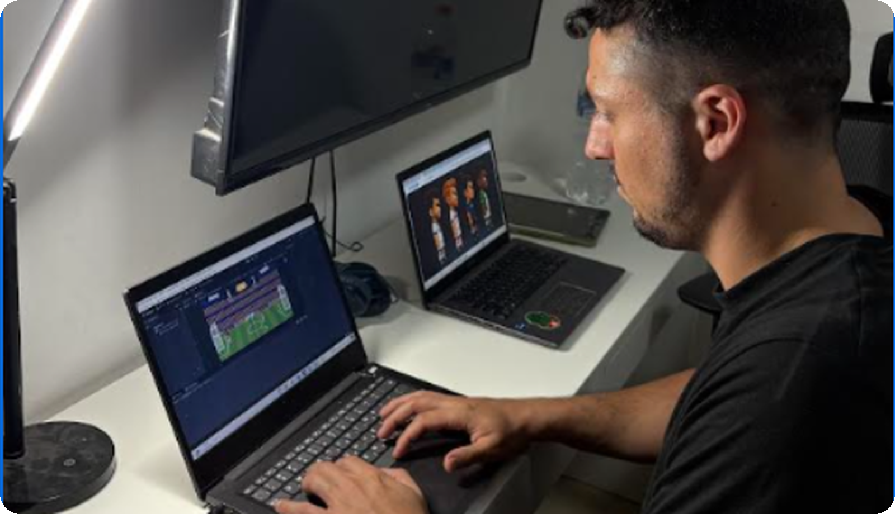

# Design decisions

Guy Yad Shalom and Tomer Yad Shalom.

Decisions made while planning Head Soccer and while playing it against each other. Each one started from something that felt wrong in a real match, and the note says what we changed and why. The numbers live in `GameConfig` (`Head-Soccer-main/Assets/Data/GameConfig.asset`) unless a note says otherwise.

## Inspiration

We love football, as people who watch it and play it as amateurs, and that is why we chose Head Soccer.
Ours is built on the original, changed only where we thought a change would make the game better.
A lot of those changes were made while we were playing, and were not planned from the start.

## 2 October 2026

### The stands are split half and half

Big tournaments seat each country's supporters on their own half of the ground, and we did the same.
The left stands fill with the home crowd of the character on the left, the right stands with the one on the right.
Flags and cheering kit go with them, so a player feels his own people behind him, and the confidence that comes with it.

## 1 October 2026

### The weather changes, the way a real ground does

A real match is not the same afternoon twice, so each kickoff rolls the weather: 50% clear, 25% rain, 25% snow.
Rain is thin slanted streaks over a darker stadium; snow is drifting flakes over a colder, brighter one.
It is the world around the match only. The ball and the players play exactly the same in every weather.

## 30 September 2026

### Beating the CPU gets an anthem

Beating a friend is its own reward; beating the CPU needs the game to notice, so a Gemini anthem plays only on a human win.
A loss to the CPU gets its own Gemini theme and the card reads GAME OVER, YOU LOST; a two-player loss keeps the whistle.
The song starts on the frame the match ends, with the crowd silent under it, and the menu loop returns when it finishes.

### The crowd is the sound of the game

A tune under the match sounded like a training session, so we replaced it with real crowd recordings from Freesound.
AxelTheCocker02's singing crowd loops under the menu; devy32's shouting supporters loop under the match itself.
Both are seamless OGG loops, credited in the README, and they duck to silence under a goal and the commentator.

### The player picks the keys

Some players have WASD in their hands and some reach for the arrows, and the wrong set costs the first match.
One button, P1 KEYS, swaps the two layouts the way FIFA offers Classic and Alternate, and the hint line follows.
`PlayerPrefs` remembers the choice, so whoever sits down is comfortable before the whistle.

### A kick shoves the rival back

Two players kicking into each other froze the match, both kick drawings stuck and the ball wedged between them.
A kick that lands on the rival now shoves him back, a small step standing and further at a run, so the ball is free.
It is deliberately small, so it opens the play without becoming a way to fight instead of play.

### Women in the roster

The original Head Soccer shipped with no women, and we do not think this game has a gender.
Noa and Anna join the four men on the same terms: their own drawings, celebrations, speed, jump and power.
Their first drawings faced the camera; they were redrawn in profile so both players face each other.

### A bigger ball

After many matches the ball was too easy to lose against the pitch, and a miss did not feel like a miss.
The radius went from 0.28 to 0.34, about a fifth bigger, so a wide shot reads as a wide shot.
The goal mouth trigger scales with it, and nothing else needed to change.

### The commentator

A goal in silence is a number changing, so one of three commentators is drawn per match and shouts every goal.
He stands in the crowd above the goal the ball went in, LIVE tag over his head, and the kickoff whistle cuts him off.
The first version was a framed box in the corner; the cut-out figure inside the stadium is what made it feel alive. 
The audio of the commentator made with precise prompt we wrote to Gemini describing exactly the type of goal sound.

### The mirror match, a painful dilemma

Both of us wanted to block two players from picking the same character, because Yossi against Yossi looked pointless.
We decided we cannot: blocking it tells people how to play, and somebody may want exactly that.
The two are told apart by facing and by the names on the scoreboard. It hurt to leave in, and it was the right call.

## 28 September 2026

### At the desk

Most of the game was settled at the desk, the match on one screen and the players on the other.
The rest was settled by playing each other, which is where the surprises showed up.
The decisions in this log are the things that only appeared once we were actually building and playing.

## 27 September 2026

### The kick angle is random

Every kick left the foot at the same angle, so rallies went flat and you could see the next ball coming.
Each kick now leaves at a fresh random angle between 0 and 45 degrees: a flat drive, or a lob.
`KickHitbox` rolls it once per kick, and the old fixed upward bias is gone.

### A running kick hits harder than a standing one

In real football a shot on the run and a shot from a standing foot are not the same thing, and the run is part of the power.
`kickMomentumBonus` adds up to 50% impulse at full speed toward the goal.
Standing still stays at the base power, and running away from the ball never weakens a kick.

### The advertising boards

There is no football without advertising, and a pitch with no boards looks like a practice field.
A scrolling board runs in front of the first row of the crowd, the way a real ground hides the spectators' legs.
The brands on it are both real from our own lives and fictional: the shawarma place (fictional place we created), the college, the food app, the card company, the game everyone waits for (GTA).

### Celebrations on the character select screen

Football games open with a lineup, each player with his own celebration, and we wanted our roster to feel like people.
On the select screen each one stands, loops his celebration, and drops back to idle: a badge kiss, a heart, a bow, a backflip.
It plays on that screen only. Once the match starts they go back to the idle and kick drawings.

### How tall the goal should be

Too tall, and the ball sailed in over the players with no way to reach it. Too short, and they stood taller than the crossbar.
The crossbar now sits at one and a half times the height of their heads, so a header still needs a jump.
That replaced an earlier pass at twice the head height, which was the version where goals arrived in a stream.
