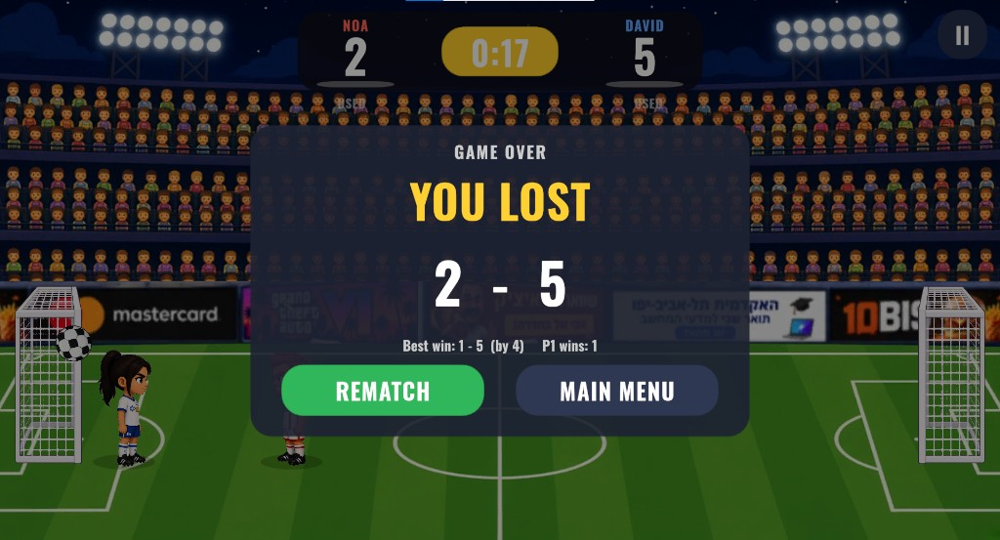

# Head Soccer

A 1v1 arcade Head Soccer game built in Unity 6 (URP, 2D). Two big-headed characters on one screen, arcade ball physics, 90-second matches to five goals, and a Super shot each player can fire once per match. Runs on Windows and as an Android APK with touch controls.

Final project for the Unity course. The approved design document is in [`Docs/GDD.md`](Docs/GDD.md); the Unity project is in [`Head-Soccer-main/`](Head-Soccer-main/).

## Screenshots

| Main menu | Character select |
|---|---|
|  |  |

| Match | Match over |
|---|---|
|  |  |

## How to play

- **Goal:** put the ball in the other net. First to 5 goals, or the higher score when the 90-second clock hits zero, wins.
- **Super:** staying on the ball fills your Super meter (under your score). When it reads SUPER READY, your next kick is a boosted shot with slow motion. One per match.

| Action | Player 1 | Player 2 | Gamepad | Touch |
|---|---|---|---|---|
| Move | A / D | Left / Right | Left stick / D-pad | ◄ ► buttons |
| Jump | W | Up | South (A / Cross) | JUMP |
| Kick / Super | Space | Right Ctrl | West or East | KICK |
| Pause | Esc | Esc | | II button |

The first gamepad drives Player 1, the second drives Player 2.

## Run it

**Windows / editor**

1. Unity Hub → **Add** → `Head-Soccer-main` (Unity **6000.3.20f1**).
2. Open `Assets/Scenes/Menu.unity` and press **Play**.

**Android**

1. Install *Android Build Support* (with SDK, NDK and OpenJDK) for the same Unity version from Unity Hub.
2. In Unity: **Head Soccer → Build Android APK**. The APK is written to `Head-Soccer-main/Builds/Android/HeadSoccer.apk`.
3. Copy it to a phone and install. The game locks to landscape and shows on-screen buttons.

## Course concepts used

| Concept | Where |
|---|---|
| **Singleton** | `GameManager` is the only owner of match state, score and clock. `AudioManager`, `EffectsPool`, `UIManager` follow the same pattern. |
| **Object pool** | `EffectsPool` recycles a fixed set of kick sparks and goal confetti; nothing is instantiated during play. |
| **Coroutines** | 3-2-1 kickoff, goal celebration freeze, Super slow motion, kick hit-stop, score bump and goal flash in the HUD. |
| **Compile to mobile** | Android APK, touch controls, `SafeAreaFitter` for notches, `CameraFitter` keeps the whole pitch visible on any aspect ratio. |
| **ScriptableObjects** | `GameConfig` (all tuning numbers) and `CharacterRoster` (the selectable characters). |
| **Input System** | Keyboard, gamepad and touch behind one `IInputSource` interface, merged per player by `CompositeInputSource`. |
| **PlayerPrefs** | Chosen character, mute setting, best win and P1 win count. |

## Project layout

```
Head-Soccer-main/Assets
├── Art/        stadium, goal, ball and the two characters (original sprites)
├── Audio/      synthesised SFX and the match music loop
├── Data/       GameConfig, CharacterRoster, ball physics material
├── Editor/     HeadSoccerBuilder (rebuilds both scenes), HeadSoccerBuildPipeline (one-click builds)
├── Fonts/      Oswald Bold (SIL Open Font License)
├── Prefabs/    pooled particle effects
├── Scenes/     Menu.unity, Match.unity
├── Scripts/
│   ├── Core/       GameManager, GameConfig, MatchState, MatchSettings, MatchRecords, CharacterRoster, CameraFitter
│   ├── Gameplay/   PlayerController, PlayerVisual, SpecialShot, KickHitbox, BallController, GoalTrigger, AIController
│   ├── Input/      IInputSource, Keyboard/Gamepad/Touch/Composite sources, HoldButton
│   ├── UI/         UIManager, MainMenuController, CharacterSelect, SafeAreaFitter
│   ├── Audio/      AudioManager
│   └── Effects/    EffectsPool, CameraShake, SuperReadySign
└── UI/         RoundedPanel (9-sliced panel sprite)
```

## Credits

- Design, code and art: Guy Yad Shalom and Tomer Yad Shalom.
- Font: [Oswald](https://fonts.google.com/specimen/Oswald) by Vernon Adams, SIL Open Font License 1.1.
- Sound effects and music were synthesised for this project; no third-party samples are used.
