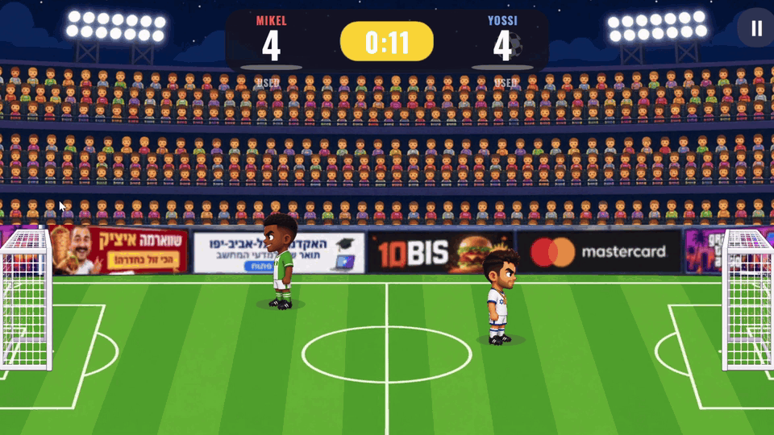
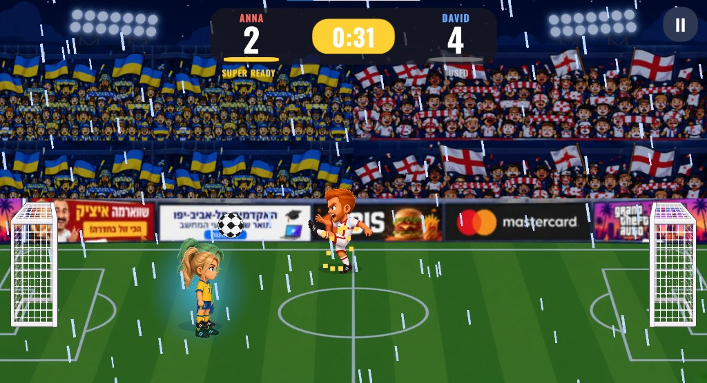

# Head Soccer

A 1v1 arcade Head Soccer game built in Unity 6 (URP, 2D). Two big-headed characters on one screen, arcade ball physics, 90-second matches to five goals, and a Super shot each player can fire once per match. Runs on Windows and as an Android APK with touch controls.

Final project for the Unity course. The approved design document is in [`Docs/GDD.md`](Docs/GDD.md). Decisions we made while planning and while playing each other are in [`Docs/design-decisions.md`](Docs/design-decisions.md). The Unity project is in [`Head-Soccer-main/`](Head-Soccer-main/).



<p align="center"><sub>Captured in a real match. The score was 4-4, and this is the goal that decided it.</sub></p>

## Screenshots

All from the Windows build.

<table>
<tr>
<th width="50%">Main menu</th>
<th width="50%">Character select</th>
</tr>
<tr>
<td width="50%"></td>
<td width="50%"></td>
</tr>
<tr>
<th width="50%">Match</th>
<th width="50%">Rain, and a Super ready</th>
</tr>
<tr>
<td width="50%"></td>
<td width="50%"></td>
</tr>
<tr>
<th width="50%">Game over</th>
<th width="50%">Pause</th>
</tr>
<tr>
<td width="50%" align="center"></td>
<td width="50%" align="center"></td>
</tr>
</table>

<p align="center"><sub>Clear, rain or snow is rolled at kickoff. Each half of the stands fills with that side's crowd. A glow around a player means that Super is ready.</sub></p>

## Run it

**Windows / editor**

1. Unity Hub → **Add** → `Head-Soccer-main` (Unity **6000.3.20f1**).
2. Open `Assets/Scenes/Menu.unity` and press **Play**.

**Android**

A ready-to-install APK is attached to the [latest GitHub Release](../../releases/latest). Copy it to a phone, allow the install from that source, and open it; the game locks to landscape and shows on-screen buttons. It has been installed and played on an Android phone.

<p align="center">

<br>
<sub>On the phone. Move on the left, JUMP and KICK on the right, pause and sound in the corner.</sub>
</p>

To build it yourself:

1. Install *Android Build Support* (with SDK, NDK and OpenJDK) for the same Unity version from Unity Hub.
2. In Unity: **Head Soccer → Build Android APK**. The APK is written to `Head-Soccer-main/Builds/Android/HeadSoccer.apk` (IL2CPP, ARM64, Android 7.1 and up).
3. Without an Android phone, the touch layout can be checked in the editor: switch the Game view to **Simulator**, pick any Android device, and the on-screen buttons appear; the mouse acts as a finger.

## How to play

- **Goal:** first to 5, or the higher score when the 90-second clock hits zero.
- **Kick:** each kick leaves at a random angle, a flat drive or a lob, and a kick on the run hits harder.
- **Super:** stay on the ball until the meter reads SUPER READY. The next kick is a boosted shot in slow motion. One per match.

| Action | WASD layout (P1 default) | ARROWS layout (P2 default) | Gamepad | Touch |
|---|---|---|---|---|
| Move | A / D | Left / Right | Left stick / D-pad | ◄ ► buttons |
| Jump | W | Up | South (A / Cross) | JUMP |
| Kick / Super | Space | Right Ctrl | West or East | KICK |
| Pause | Esc | Esc | Start | II button |

Against the CPU, **P1 KEYS** on the main menu chooses WASD or the arrows, and the game remembers it. The first gamepad is Player 1, the second is Player 2.

## Characters & Commentators


| | | | Celebration |
|---|---|---|---|
| **Yossi** | Israel | Tough and confident, never gives up | Kisses the badge |
| **David** | England | Classy and precise, plays with style | Hands make a heart |
| **Kim** | Japan | Fast and focused, samurai balance | Bows |
| **Mikel** | Nigeria | Strong and full of energy | Backflip |
| **Noa** | Israel | Fearless captain, lights up the pitch | Arms up, cheering the stands |
| **Anna** | Ukraine | Ice cool, slides into every goal | Knee slide |


<table>
<tr>
<td width="140" align="center"></td>
<td>One of the three commentators is drawn at random for each match. On every goal he pops up in the crowd above the goal that was just scored in, a red LIVE tag over his head, and shouts a call we generated with Gemini while the rest of the sound goes quiet under him (detailed in the credits below).</td>
</tr>
</table>

## Automated tests

`Head-Soccer-main/Assets/Tests/Editor` holds EditMode tests that run in the Unity Test Runner (**Window → General → Test Runner → EditMode → Run All**) without opening a scene. They cover the pure logic and, more usefully, the shipped assets:

| Suite | What it guards |
|---|---|
| `KickMathTests` | The running kick bonus: exactly 1 when standing, capped at 1 + bonus at full speed, never below 1 when running away; every kick angle in the configured range travels forward and never into the grass. |
| `SpecialShotTests` | The Super fills only from contact, never overfills, fires exactly once per match, cannot recharge after firing, and a rematch resets it. |
| `KeyboardLayoutTests` | Player two always gets the layout player one did not pick, and the choice survives in `PlayerPrefs`. |
| `MatchRecordsTests` | Biggest win and P1 win count: a smaller win keeps the bigger record, a draw records nothing. |
| `CharacterRosterTests` | The select arrows wrap at both ends; a fresh install is never a mirror match. |
| `HumanVictoryTests` | The victory anthem is earned only by beating the CPU, and the defeat theme only by losing to the CPU. A draw and any two-player result stay on the whistle. A loss to the CPU reads YOU LOST under GAME OVER; every other result still names the winner. |
| `ProjectAssetsTests` | The roster asset still has all six characters with all three drawings and sane stats (this exact asset once lost two of them on a re-save), the tuning asset can end a match, both scenes are in the build list, the commentator has three cut-outs and a call cut to six seconds, both crowd loops ship and are long enough to loop unnoticed, and the victory anthem and the defeat theme are each about ten seconds. |

Tests that touch `PlayerPrefs` run inside a sandbox that restores the player's real settings afterwards.

## Course concepts used

| Concept | Where |
|---|---|
| **Singleton** | `GameManager` is the only owner of match state, score and clock. `AudioManager`, `EffectsPool`, `UIManager` follow the same pattern. |
| **Prefabs** | `Player`, `Ball`, `Goal`, `KickSpark` and `GoalConfetti` in `Assets/Prefabs`. Both players in the match are instances of the one `Player` prefab, and both goals of the one `Goal` prefab, mirrored by scale for the right-hand side. |
| **Object pool** | `EffectsPool` recycles a fixed set of kick sparks and goal confetti; nothing is instantiated during play. |
| **Coroutines** | 3-2-1 kickoff, goal celebration freeze, Super slow motion, kick hit-stop, score bump and goal flash in the HUD. |
| **Compile to mobile** | Android APK, touch controls, `SafeAreaFitter` for notches, `CameraFitter` keeps the whole pitch visible on any aspect ratio. |
| **ScriptableObjects** | `GameConfig` (all tuning numbers) and `CharacterRoster` (the selectable characters). |
| **Input System** | Keyboard, gamepad and touch behind one `IInputSource` interface, merged per player by `CompositeInputSource`. |
| **Strategy pattern** | `PlayerController` never knows who is driving it. A human (`KeyboardInputSource`, `GamepadInputSource`, `TouchInputSource`) and the computer (`AIController`) all implement the same `IInputSource`, so swapping a player for an AI is one line. |
| **Pub/Sub events** | `GameManager` raises `ScoreChanged`, `GoalScored`, `StateChanged`, `CountdownChanged` and `MatchEnded`. `UIManager` subscribes and updates the HUD, pause and match-over panels from those events, and `CommentatorCutIn` subscribes to `GoalScored` and `StateChanged` for the commentator; the manager never holds a reference to either. |
| **PlayerPrefs** | Both chosen characters, keyboard layout, mute setting, best win and P1 win count. |

## Project layout

```
Head-Soccer-main/Assets
├── Art/        stadium, goal, ball, ad board, Characters/ (six players, idle + kick + celebration), Commentators/
├── Audio/      synthesised SFX, the two crowd loops (menu, match), the commentator's goal call, and the win and loss songs
├── Data/       GameConfig, CharacterRoster, ball physics material
├── Editor/     HeadSoccerBuilder (rebuilds both scenes), HeadSoccerBuildPipeline (one-click builds)
├── Fonts/      Oswald Bold (SIL Open Font License)
├── Prefabs/    Player, Ball, Goal, and the pooled particle effects
├── Resources/  Crowds/ (five country crowd drawings, loaded by CrowdController)
├── Scenes/     Menu.unity, Match.unity
├── Scripts/
│   ├── Core/       GameManager, GameConfig, MatchState, MatchSettings, MatchRecords, CharacterRoster, CameraFitter
│   ├── Gameplay/   PlayerController, PlayerVisual, SpecialShot, KickHitbox, KickMath, BallController, GoalTrigger, AIController
│   ├── Input/      IInputSource, Keyboard/Gamepad/Touch/Composite sources, HoldButton
│   ├── UI/         UIManager, MainMenuController, CharacterSelect, CelebrationLoop, CommentatorCutIn, SafeAreaFitter
│   ├── Audio/      AudioManager
│   └── Effects/    EffectsPool, CameraShake, SuperReadySign, AdBoard, WeatherController, CrowdController
├── Tests/Editor/   EditMode tests (see Automated tests)
└── UI/         RoundedPanel (9-sliced panel sprite)
```

## Credits

- Design, code and art direction: Guy Yad Shalom and Tomer Yad Shalom.
- Character and commentator drawings: made with ChatGPT from our descriptions, for this project.
- Commentator goal call: generated with Gemini from an explicit prompt describing exactly the call we wanted, then cut to six seconds and loudness matched. It plays over every goal while the crowd and the effects duck under it, and it is cut the moment the whistle puts the ball back in play. The three commentator drawings share one call; the one who speaks is the one drawn for that match.
- Victory anthem, heard only when the player beats the CPU: generated with Gemini for this project, so the win feels like it mattered. The crowd and the effects go silent under it.
- Defeat theme, heard only when the player loses to the CPU: generated with Gemini from a precise prompt we wrote for that moment, so a loss is its own moment and not the anthem played sadly. The crowd and the effects go silent under it too. A two-player match and a draw keep the final whistle.
- The code was drafted with AI models. We reviewed it before it stayed: what belonged in the game remained, and what did not was changed. The design and the decisions are ours.
- Font: [Oswald](https://fonts.google.com/specimen/Oswald) by Vernon Adams, SIL Open Font License 1.1.
- Sound effects and the goal fanfare were synthesised for this project.
- Match crowd: ["Football supporters in stadium"](https://freesound.org/people/devy32/sounds/606958/) by **devy32**, from [Freesound](https://freesound.org), licensed under [Creative Commons Attribution 4.0](https://creativecommons.org/licenses/by/4.0/). Cut into a seamless loop and loudness matched for the game; it plays under the match.
- Menu crowd: ["stadium crowd sing"](https://freesound.org/people/axelthecocker02/sounds/733614/) by **AxelTheCocker02**, from Freesound, released under [CC0 1.0](https://creativecommons.org/publicdomain/zero/1.0/) (no attribution required, credited anyway). Cut into a seamless loop; it plays under the main menu.
