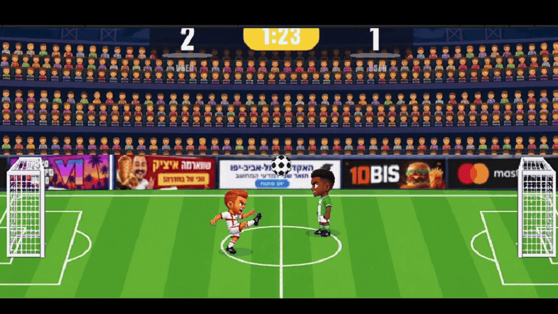
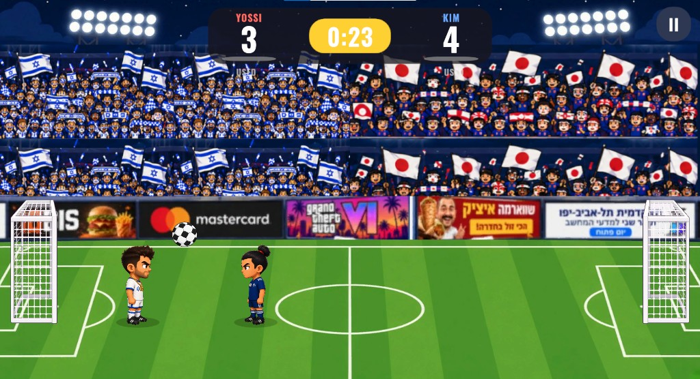
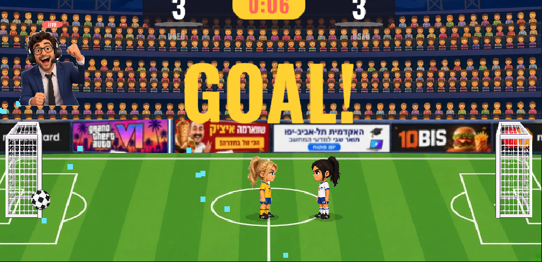
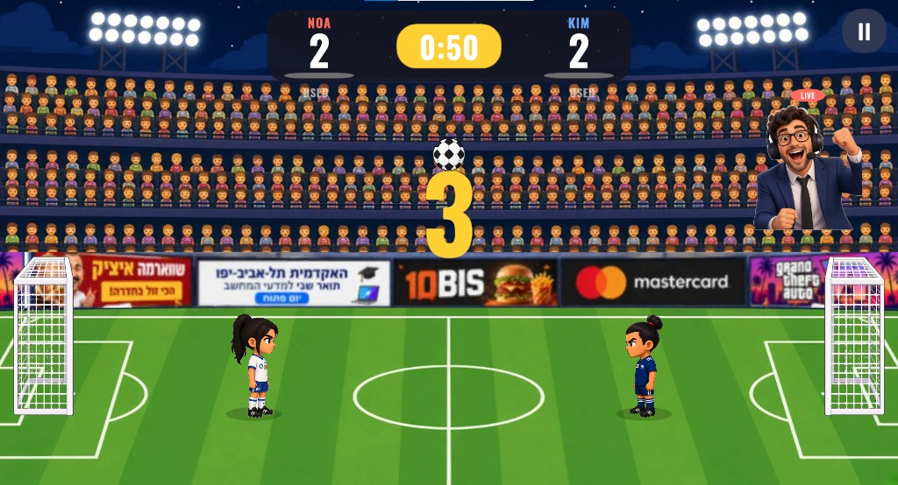

# Head Soccer

A 1v1 arcade Head Soccer game built in Unity 6 (URP, 2D). Two big-headed characters on one screen, arcade ball physics, 90-second matches to five goals, and a Super shot each player can fire once per match. Runs on Windows and as an Android APK with touch controls.

Final project for the Unity course. The approved design document is in [`Docs/GDD.md`](Docs/GDD.md). Decisions we made while planning and while playing each other are in [`Docs/design-decisions.md`](Docs/design-decisions.md). The Unity project is in [`Head-Soccer-main/`](Head-Soccer-main/).



## Vision

We chose Head Soccer because we love football. We like to play and watch football, so this was not a theme we picked to fill a project. The passion was already there, and that is why getting the details right mattered so much to us. We know, from being players ourselves, how much a small thing decides whether a match feels real.

## Screenshots


| Character select | Match |
|---|---|
|  |  |

| Game over | |
|---|---|
|  | A loss to the CPU. GAME OVER and YOU LOST, the scoreline, the best win so far and the P1 wins counter from `PlayerPrefs`, and two ways out. |

## Run it

**Windows / editor**

1. Unity Hub → **Add** → `Head-Soccer-main` (Unity **6000.3.20f1**).
2. Open `Assets/Scenes/Menu.unity` and press **Play**.

**Android**

A ready-to-install APK is attached to the [latest GitHub Release](../../releases/latest). Copy it to a phone and install; the game locks to landscape and shows on-screen buttons. To build it yourself:

1. Install *Android Build Support* (with SDK, NDK and OpenJDK) for the same Unity version from Unity Hub.
2. In Unity: **Head Soccer → Build Android APK**. The APK is written to `Head-Soccer-main/Builds/Android/HeadSoccer.apk` (IL2CPP, ARM64, Android 7.1 and up).
3. Without an Android phone, the touch layout can be checked in the editor: switch the Game view to **Simulator**, pick any Android device, and the on-screen buttons appear; the mouse acts as a finger.

**Browser**

**Head Soccer → Build Web (browser)** writes a WebGL build to `Head-Soccer-main/Builds/Web` (needs the Web Build Support module). The folder is a static site: upload it as-is to itch.io or GitHub Pages.

## How to play

- **Goal:** put the ball in the other net. First to 5 goals, or the higher score when the 90-second clock hits zero, wins.
- **Kick:** no two kicks are the same. The ball leaves the foot at a random angle, a flat drive one time and a lob the next, and a kick on the run hits harder than a kick standing still.
- **Super:** staying on the ball fills your Super meter (under your score). When it reads SUPER READY, your next kick is a boosted shot with slow motion. One per match.
- **Contact:** a kick that lands on the other player shoves them a step back, a little further if you arrived at a run. It keeps two players from locking up with the ball stuck between them.

| Action | WASD layout (P1 default) | ARROWS layout (P2 default) | Gamepad | Touch |
|---|---|---|---|---|
| Move | A / D | Left / Right | Left stick / D-pad | ◄ ► buttons |
| Jump | W | Up | South (A / Cross) | JUMP |
| Kick / Super | Space | Right Ctrl | West or East | KICK |
| Pause | Esc | Esc | Start | II button |

**Pick your keys.** Some of us have WASD in our hands from PC games, some reach for the arrows. The **P1 KEYS** button on the main menu swaps the two layouts between the players, the way FIFA lets you pick Classic or Alternate, and the game remembers it. The first gamepad drives Player 1, the second drives Player 2.

## The players

The roster was drawn for this project, with ChatGPT working from our descriptions, and inspired by the makers of the game we set out to build. We wanted the players to feel different from each other, so we picked six countries and built one character around each of them. Each one has an idle drawing, a kick drawing and their own goal celebration, and each one plays a little differently in speed, jump and power. Who they are, and the celebration that goes with them, is on the select screen below.

**Noa and Anna.** The original Head Soccer, as far as we remember it, shipped with no women; the launch roster was men, aliens and monsters. We played that game for years. Ours is for everyone who plays football, not for men only, because we do not think this game has a gender, so Noa and Anna are in on the same terms as the four men: their own drawings, their own celebrations, their own stats. We already said, about the advertising boards, that a game carries a message beyond the match. This is the same thought, and we would rather set this one right than repeat it.

Both sides are chosen before kickoff. Player 1 picks first. Then, in a 2 PLAYERS match, Player 2 picks their own; against the computer, you pick who the CPU plays as. Two players may pick the same character. We thought about blocking that and decided not to tell anyone how to play.

## The commentator






After the goal he stays up through the count, on the side that was just scored in, and he is gone the moment play resumes.

There is no football without a commentator. At the start of every match one of these three is drawn at random and he is the voice of that match. On every goal he pops up in the crowd above the goal that just received the ball, a small red LIVE tag over his head, and shouts the call while the celebration freezes and the kickoff counts down. The game mix goes silent under him so the call is the only thing you hear, and the moment the whistle puts the ball back in play he is cut and gone until the next one.

This was never in the plan. We fell in love with the idea while building, because a goal in silence is a number changing and a goal with a voice is a goal. It is there for one reason, to make the match feel alive.

## Select character window


One picture does both jobs. You see the character, and you see what they do when they score.

| | | | Celebration |
|---|---|---|---|
| **Yossi** | Israel | Tough and confident, never gives up | Kisses the badge |
| **David** | England | Classy and precise, plays with style | Hands make a heart |
| **Kim** | Japan | Fast and focused, samurai balance | Bows |
| **Mikel** | Nigeria | Strong and full of energy | Backflip |
| **Noa** | Israel | Fearless captain, lights up the pitch | Arms up, cheering the stands |
| **Anna** | Ukraine | Ice cool, slides into every goal | Knee slide |

On this screen the portrait is alive: the player stands for a moment, hops into that celebration, holds it, and drops back to idle. Arrows on the card change the character and the bars show speed, jump and power. The screen runs twice: **NEXT** after Player 1's choice, then the right side (Player 2, or the CPU's player when you play the computer), and **KICK OFF!** starts the match. The celebration plays here only. Once the match starts, the players go back to their idle and kick drawings.

## Automated tests

`Head-Soccer-main/Assets/Tests/Editor` holds EditMode tests that run in the Unity Test Runner (**Window → General → Test Runner → EditMode → Run All**) without opening a scene. They cover the pure logic and, more usefully, the shipped assets:

| Suite | What it guards |
|---|---|
| `KickMathTests` | The running kick bonus: exactly 1 when standing, capped at 1 + bonus at full speed, never below 1 when running away; every kick angle in the configured range travels forward and never into the grass. |
| `SpecialShotTests` | The Super fills only from contact, never overfills, fires exactly once per match, cannot recharge after firing, and a rematch resets it. |
| `KeyboardLayoutTests` | Player two always gets the layout player one did not pick, and the choice survives in `PlayerPrefs`. |
| `MatchRecordsTests` | Biggest win and P1 win count: a smaller win keeps the bigger record, a draw records nothing. |
| `CharacterRosterTests` | The select arrows wrap at both ends; a fresh install is never a mirror match. |
| `HumanVictoryTests` | The victory anthem is earned only by beating the CPU, and the defeat theme only by losing to the CPU. A draw and any two-player result stay on the whistle. A loss to the CPU reads YOU LOST under GAME OVER; every other result still names the winner. |
| `ProjectAssetsTests` | The roster asset still has all six characters with all three drawings and sane stats (this exact asset once lost two of them on a re-save), the tuning asset can end a match, both scenes are in the build list, the commentator has three cut-outs and a call cut to six seconds, both crowd loops ship and are long enough to loop unnoticed, and the victory anthem and the defeat theme are each about ten seconds. |

Tests that touch `PlayerPrefs` run inside a sandbox that restores the player's real settings afterwards.

## Course concepts used

| Concept | Where |
|---|---|
| **Singleton** | `GameManager` is the only owner of match state, score and clock. `AudioManager`, `EffectsPool`, `UIManager` follow the same pattern. |
| **Prefabs** | `Player`, `Ball`, `Goal`, `KickSpark` and `GoalConfetti` in `Assets/Prefabs`. Both players in the match are instances of the one `Player` prefab, and both goals of the one `Goal` prefab, mirrored by scale for the right-hand side. |
| **Object pool** | `EffectsPool` recycles a fixed set of kick sparks and goal confetti; nothing is instantiated during play. |
| **Coroutines** | 3-2-1 kickoff, goal celebration freeze, Super slow motion, kick hit-stop, score bump and goal flash in the HUD. |
| **Compile to mobile** | Android APK, touch controls, `SafeAreaFitter` for notches, `CameraFitter` keeps the whole pitch visible on any aspect ratio. |
| **ScriptableObjects** | `GameConfig` (all tuning numbers) and `CharacterRoster` (the selectable characters). |
| **Input System** | Keyboard, gamepad and touch behind one `IInputSource` interface, merged per player by `CompositeInputSource`. |
| **Command pattern** | `PlayerController` never knows who is driving it. A human (`KeyboardInputSource`, `GamepadInputSource`, `TouchInputSource`) and the computer (`AIController`) all implement the same `IInputSource`, so swapping a player for an AI is one line. |
| **Pub/Sub events** | `GameManager` raises `ScoreChanged`, `GoalScored`, `StateChanged`, `CountdownChanged` and `MatchEnded`. `UIManager` subscribes and updates the HUD, pause and match-over panels from those events, and `CommentatorCutIn` subscribes to `GoalScored` and `StateChanged` for the commentator; the manager never holds a reference to either. |
| **PlayerPrefs** | Both chosen characters, keyboard layout, mute setting, best win and P1 win count. |

## Project layout

```
Head-Soccer-main/Assets
├── Art/        stadium, goal, ball, ad board, Characters/ (six players, idle + kick + celebration), Commentators/
├── Audio/      synthesised SFX, the two crowd loops (menu, match), the commentator's goal call, and the win and loss songs
├── Data/       GameConfig, CharacterRoster, ball physics material
├── Editor/     HeadSoccerBuilder (rebuilds both scenes), HeadSoccerBuildPipeline (one-click builds)
├── Fonts/      Oswald Bold (SIL Open Font License)
├── Prefabs/    Player, Ball, Goal, and the pooled particle effects
├── Scenes/     Menu.unity, Match.unity
├── Scripts/
│   ├── Core/       GameManager, GameConfig, MatchState, MatchSettings, MatchRecords, CharacterRoster, CameraFitter
│   ├── Gameplay/   PlayerController, PlayerVisual, SpecialShot, KickHitbox, KickMath, BallController, GoalTrigger, AIController
│   ├── Input/      IInputSource, Keyboard/Gamepad/Touch/Composite sources, HoldButton
│   ├── UI/         UIManager, MainMenuController, CharacterSelect, CelebrationLoop, CommentatorCutIn, SafeAreaFitter
│   ├── Audio/      AudioManager
│   └── Effects/    EffectsPool, CameraShake, SuperReadySign, AdBoard
├── Tests/Editor/   EditMode tests (see Automated tests)
└── UI/         RoundedPanel (9-sliced panel sprite)
```

## Credits

- Design, code and art direction: Guy Yad Shalom and Tomer Yad Shalom.
- Character and commentator drawings: made with ChatGPT from our descriptions, for this project.
- Commentator goal call: generated with Gemini from an explicit prompt describing exactly the call we wanted.
- Victory anthem, heard only when the player beats the CPU: generated with Gemini for this project, so the win feels like it mattered. The crowd and the effects go silent under it.
- Defeat theme, heard only when the player loses to the CPU: generated with Gemini from a precise prompt we wrote for that moment, so a loss is its own moment and not the anthem played sadly. The crowd and the effects go silent under it too. A two-player match and a draw keep the final whistle.
- We combined several AI tools and took from each one what it does best; the design, the code and every decision are ours.
- Font: [Oswald](https://fonts.google.com/specimen/Oswald) by Vernon Adams, SIL Open Font License 1.1.
- Sound effects and the goal fanfare were synthesised for this project.
- Match crowd: ["Football supporters in stadium"](https://freesound.org/people/devy32/sounds/606958/) by **devy32**, from [Freesound](https://freesound.org), licensed under [Creative Commons Attribution 4.0](https://creativecommons.org/licenses/by/4.0/). Cut into a seamless loop and loudness matched for the game; it plays under the match.
- Menu crowd: ["stadium crowd sing"](https://freesound.org/people/axelthecocker02/sounds/733614/) by **AxelTheCocker02**, from Freesound, released under [CC0 1.0](https://creativecommons.org/publicdomain/zero/1.0/) (no attribution required, credited anyway). Cut into a seamless loop; it plays under the main menu.
