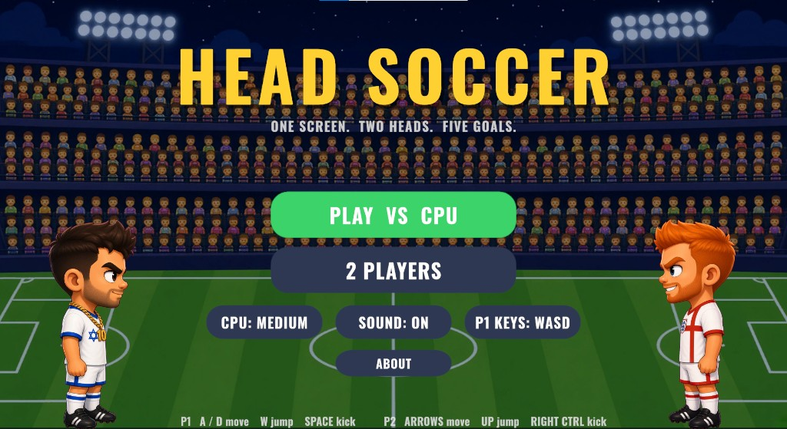
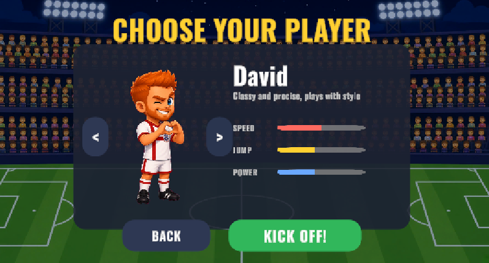
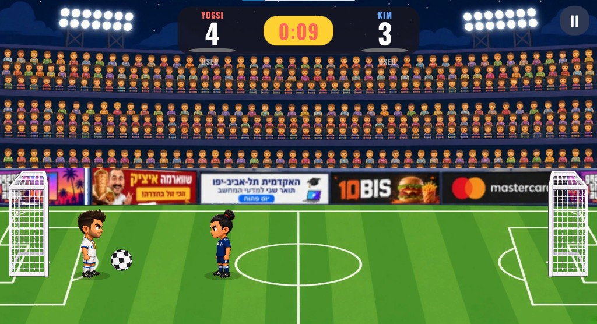
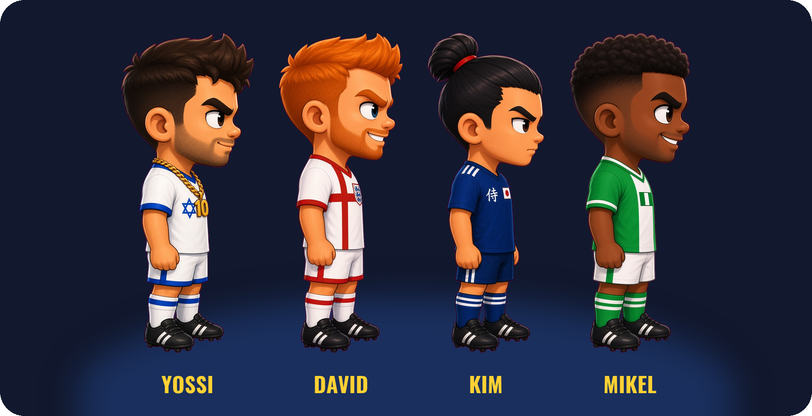

# Head Soccer

A 1v1 arcade Head Soccer game built in Unity 6 (URP, 2D). Two big-headed characters on one screen, arcade ball physics, 90-second matches to five goals, and a Super shot each player can fire once per match. Runs on Windows and as an Android APK with touch controls.

Final project for the Unity course. The approved design document is in [`Docs/GDD.md`](Docs/GDD.md). Decisions we made while planning and while playing each other are in [`Docs/design-decisions.md`](Docs/design-decisions.md). The Unity project is in [`Head-Soccer-main/`](Head-Soccer-main/).

## Vision

We chose Head Soccer because we love football. It is the game we play and the game we watch, so this was not a theme we picked to fill a project. The passion was already there, and that is why getting the details right mattered so much to us. We know, from being players ourselves, how much a small thing decides whether a match feels real.

## Screenshots



| Character select | Match |
|---|---|
|  |  |

## How to play

- **Goal:** put the ball in the other net. First to 5 goals, or the higher score when the 90-second clock hits zero, wins.
- **Kick:** no two kicks are the same. The ball leaves the foot at a random angle, a flat drive one time and a lob the next, and a kick on the run hits harder than a kick standing still.
- **Super:** staying on the ball fills your Super meter (under your score). When it reads SUPER READY, your next kick is a boosted shot with slow motion. One per match.
- **Contact:** a kick that lands on the other player shoves them a step back, a little further if you arrived at a run. It keeps two players from locking up with the ball stuck between them.

| Action | WASD layout (P1 default) | ARROWS layout (P2 default) | Gamepad | Touch |
|---|---|---|---|---|
| Move | A / D | Left / Right | Left stick / D-pad | ◄ ► buttons |
| Jump | W | Up | South (A / Cross) | JUMP |
| Kick / Super | Space | Right Ctrl | West or East | KICK |
| Pause | Esc | Esc | | II button |

**Pick your keys.** Some of us have WASD in our hands from PC games, some reach for the arrows. The **P1 KEYS** button on the main menu swaps the two layouts between the players, the way FIFA lets you pick Classic or Alternate, and the game remembers it. The first gamepad drives Player 1, the second drives Player 2.

## The players



The roster was drawn for this project, with ChatGPT working from our descriptions, and inspired by the makers of the game we set out to build. We wanted the players to feel different from each other, so we picked six countries and built one character around each of them. Each one has an idle drawing, a kick drawing and their own goal celebration, and each one plays a little differently in speed, jump and power.

| | | | Celebration |
|---|---|---|---|
| **Yossi** | Israel | Tough and confident, never gives up | Kisses the badge |
| **David** | England | Classy and precise, plays with style | Hands make a heart |
| **Kim** | Japan | Fast and focused, samurai balance | Bows |
| **Mikel** | Nigeria | Strong and full of energy | Backflip |
| **Noa** | Israel | Fearless captain, lights up the pitch | Arms up, cheering the stands |
| **Anna** | Ukraine | Ice cool, slides into every goal | Knee slide |

**Noa and Anna.** The original Head Soccer, as far as we remember it, shipped with no women; the launch roster was men, aliens and monsters. We played that game for years. Ours is for everyone who plays football, not for men only, because we do not think this game has a gender, so Noa and Anna are in on the same terms as the four men: their own drawings, their own celebrations, their own stats. We already said, about the advertising boards, that a game carries a message beyond the match. This is the same thought, and we would rather set this one right than repeat it.

Both sides are chosen before kickoff. Player 1 picks first. Then, in a 2 PLAYERS match, Player 2 picks their own; against the computer, you pick who the CPU plays as. Two players may pick the same character. We thought about blocking that and decided not to tell anyone how to play.

## The commentator


There is no football without a commentator. At the start of every match one of these three is drawn at random and he is the voice of that match. On every goal he pops up in the crowd above the goal that just received the ball, a small red LIVE tag over his head, and shouts the call while the celebration freezes and the kickoff counts down. The game mix goes silent under him so the call is the only thing you hear, and the moment the whistle puts the ball back in play he is cut and gone until the next one.

This was never in the plan. We fell in love with the idea while building, because a goal in silence is a number changing and a goal with a voice is a goal. It is there for one reason, to make the match feel alive.

## Select character window


This is the screen before kickoff. The portrait in the middle is alive: the player stands for a moment, hops into their own goal celebration, holds it, and drops back to idle, then does it again.

| | Celebration |
|---|---|
| **Yossi** | Kneels and kisses the badge on his shirt |
| **David** | Beats a heart with his hands |
| **Kim** | Bows to you, the player, not to the side |
| **Mikel** | Crouches, backflips and lands on his feet |
| **Noa** | Both arms to the sky, bouncing to the crowd |
| **Anna** | Slides in on her knees, straight at you |

Arrows on the card change the character and the bars show speed, jump and power. The screen runs twice: **NEXT** after Player 1's choice, then the right side (Player 2, or the CPU's player when you play the computer), and **KICK OFF!** starts the match. The celebration plays on this screen only. Once the match starts, the players go back to their idle and kick drawings.

## The stadium

Below the crowd runs an advertising board, the way every real ground has one. Football has always carried messages beyond the game itself, and we wanted the pitch to reflect that world rather than a sterile one. So the board shows real things: the shawarma place, the academic college this project was made for, the food app, the card company and the game everyone is waiting for.

## Creation time


Most of the game was settled at the desk, the match on one screen and the four players on the other, and then by playing each other. A few things only showed up once we were actually building and playing:

- **The kick angle.** Every kick left the foot the same way, so rallies went flat and you could see the next ball coming. The angle is now random, from 0 to 45 degrees: a flat drive one time, a lob the next.
- **A running kick.** In real football a shot from a standing foot and a shot on the run are not the same thing, and in our first build they were. A player at full speed toward the goal now hits up to 50% harder. Standing still stays at the base power.
- **The crossbar.** We tried the goals at several heights. Too tall, and the ball sailed in over the players with no way to reach it. Too short, and the players stood taller than the goal. The crossbar now sits at one and a half times the height of their heads.
- **The shove.** Two players kicking at each other with the ball wedged between them froze the match, both kick drawings stuck in place. A kick that lands on the other player now shoves them a small step back, further from a running kick, and the ball is free again.
- **The ball.** After many matches it read as too small. It is about a fifth bigger now and a miss finally feels like a miss.
- **The music.** The first loop was pleasant, and a 90 second sprint to five goals is not pleasant. The new loop runs at 150 bpm with a chant-like hook, and the goal sound became a fanfare.

The full log, and the decisions we add as we keep playing, is in [`Docs/design-decisions.md`](Docs/design-decisions.md).

## Run it

**Windows / editor**

1. Unity Hub → **Add** → `Head-Soccer-main` (Unity **6000.3.20f1**).
2. Open `Assets/Scenes/Menu.unity` and press **Play**.

**Android**

1. Install *Android Build Support* (with SDK, NDK and OpenJDK) for the same Unity version from Unity Hub.
2. In Unity: **Head Soccer → Build Android APK**. The APK is written to `Head-Soccer-main/Builds/Android/HeadSoccer.apk`.
3. Copy it to a phone and install. The game locks to landscape and shows on-screen buttons.

## Course concepts used

| Concept | Where |
|---|---|
| **Singleton** | `GameManager` is the only owner of match state, score and clock. `AudioManager`, `EffectsPool`, `UIManager` follow the same pattern. |
| **Prefabs** | `Player`, `Ball`, `Goal`, `KickSpark` and `GoalConfetti` in `Assets/Prefabs`. Both players in the match are instances of the one `Player` prefab, and both goals of the one `Goal` prefab, mirrored by scale for the right-hand side. |
| **Object pool** | `EffectsPool` recycles a fixed set of kick sparks and goal confetti; nothing is instantiated during play. |
| **Coroutines** | 3-2-1 kickoff, goal celebration freeze, Super slow motion, kick hit-stop, score bump and goal flash in the HUD. |
| **Compile to mobile** | Android APK, touch controls, `SafeAreaFitter` for notches, `CameraFitter` keeps the whole pitch visible on any aspect ratio. |
| **ScriptableObjects** | `GameConfig` (all tuning numbers) and `CharacterRoster` (the selectable characters). |
| **Input System** | Keyboard, gamepad and touch behind one `IInputSource` interface, merged per player by `CompositeInputSource`. |
| **Command pattern** | `PlayerController` never knows who is driving it. A human (`KeyboardInputSource`, `GamepadInputSource`, `TouchInputSource`) and the computer (`AIController`) all implement the same `IInputSource`, so swapping a player for an AI is one line. |
| **Pub/Sub events** | `GameManager` raises `ScoreChanged`, `GoalScored`, `StateChanged`, `CountdownChanged` and `MatchEnded`. `UIManager` subscribes and updates the HUD, pause and match-over panels from those events, and `CommentatorCutIn` subscribes to `GoalScored` and `StateChanged` for the commentator; the manager never holds a reference to either. |
| **PlayerPrefs** | Both chosen characters, keyboard layout, mute setting, best win and P1 win count. |

## Project layout

```
Head-Soccer-main/Assets
├── Art/        stadium, goal, ball, ad board, Characters/ (six players, idle + kick + celebration), Commentators/
├── Audio/      synthesised SFX, the match music loop and the commentator's goal call
├── Data/       GameConfig, CharacterRoster, ball physics material
├── Editor/     HeadSoccerBuilder (rebuilds both scenes), HeadSoccerBuildPipeline (one-click builds)
├── Fonts/      Oswald Bold (SIL Open Font License)
├── Prefabs/    Player, Ball, Goal, and the pooled particle effects
├── Scenes/     Menu.unity, Match.unity
├── Scripts/
│   ├── Core/       GameManager, GameConfig, MatchState, MatchSettings, MatchRecords, CharacterRoster, CameraFitter
│   ├── Gameplay/   PlayerController, PlayerVisual, SpecialShot, KickHitbox, BallController, GoalTrigger, AIController
│   ├── Input/      IInputSource, Keyboard/Gamepad/Touch/Composite sources, HoldButton
│   ├── UI/         UIManager, MainMenuController, CharacterSelect, CelebrationLoop, CommentatorCutIn, SafeAreaFitter
│   ├── Audio/      AudioManager
│   └── Effects/    EffectsPool, CameraShake, SuperReadySign, AdBoard
└── UI/         RoundedPanel (9-sliced panel sprite)
```

## Credits

- Design, code and art direction: Guy Yad Shalom and Tomer Yad Shalom.
- Character and commentator drawings: made with ChatGPT from our descriptions, for this project.
- Commentator goal call: generated with Gemini from an explicit prompt describing exactly the call we wanted.
- We combined several AI tools and took from each one what it does best; the design, the code and every decision are ours.
- Font: [Oswald](https://fonts.google.com/specimen/Oswald) by Vernon Adams, SIL Open Font License 1.1.
- Sound effects and music were synthesised for this project; no third-party samples are used.
